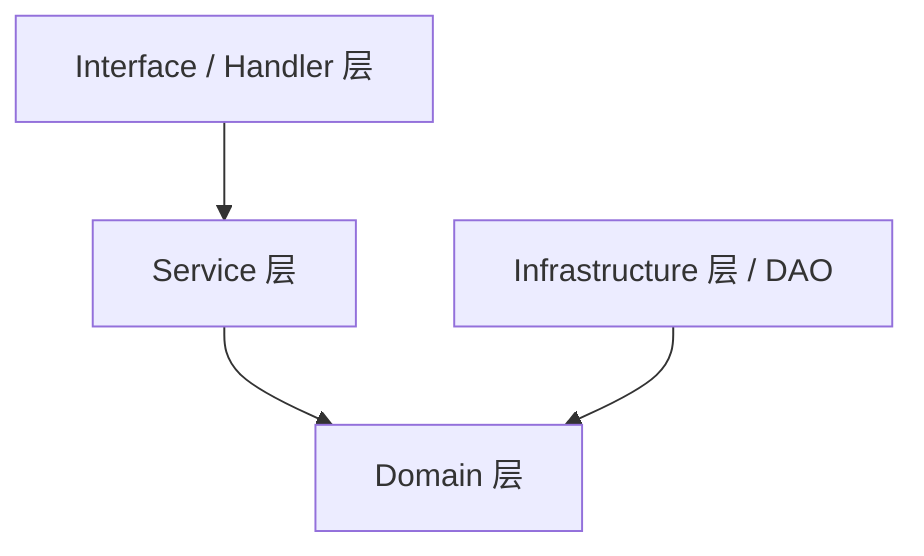

# 领域驱动设计 (DDD) 架构实践指南

## 1. DDD 核心理念

Domain-Driven Design (DDD) 是一种以**领域模型**为中心的软件开发方法。它的核心目标是应对复杂业务系统的设计，通过将业务领域概念映射到代码结构中，使得代码能清晰地表达业务意图。

在本项目中，我们采用了简化版的 DDD 分层架构，主要关注**依赖倒置（Dependency Inversion）**和**职责分离（Separation of Concerns）**。

## 2. 传统三层架构 vs DDD 四层架构

### 传统三层架构的痛点
在传统的 `Controller -> Service -> DAO` 架构中：
1. **依赖方向错误**：Service 层直接依赖具体的 DAO 实现（如 `*mysql.Repositories`）。
2. **耦合度高**：如果想要更换存储介质（如从 MySQL 换到 PostgreSQL，或者为了单元测试使用 Mock），必须要修改 Service 层的代码。
3. **业务逻辑被技术细节污染**：业务流程中混合了具体的 SQL 调用、缓存读写逻辑。

### 本项目的 DDD 分层实践



**最核心的转变：业务核心（Domain/Service）不再依赖任何外部细节（Infrastructure/DAO），而是外部细节依赖业务核心。**

## 3. 各层职责详解

### 3.1 Interface 层 (Handler)
- **位置**：`internal/handler`
- **职责**：
  - 接收外部请求（HTTP、WebSocket、RPC 等）
  - 参数校验与绑定（Validation）
  - 调用相关的 Service
  - 组装并返回响应数据（DTO）
- **规则**：不能包含任何业务逻辑，不能直接读写数据库。

### 3.2 Service 层 (Application Service)
- **位置**：`internal/service`
- **职责**：
  - 编排业务流程（Use Cases）
  - 协调多个领域模型和仓储（Repository）完成复杂的业务动作（如创建群组、添加好友）
  - 控制数据库事务（Transaction）
  - 处理权限控制、缓存更新逻辑
- **规则**：
  - **绝不能**导入 `internal/dao/mysql` 等具体实现包。
  - 仅能通过接口（Interfaces）与数据访问层交互。

### 3.3 Domain 层 (Core)
- **位置**：`internal/domain`, `internal/model`
- **职责**：
  - 定义领域实体（Entity）和值对象（Value Object），如 `User`, `Group`, `Message` 结构体。
  - 定义领域服务接口和**仓储接口（Repository Interfaces）**。
- **规则**：Domain 层是系统的中心，它**不依赖任何其他层**，只依赖 Go 标准库。

##### 示例：Repository 接口定义
```go
// internal/domain/repository/user.go
type UserRepository interface {
    FindByUuid(ctx context.Context, uuid string) (*model.User, error)
    CreateUser(ctx context.Context, user *model.User) error
    // ...
}
```

### 3.4 Infrastructure 层 (DAO / Cache / External APIs)
- **位置**：`internal/dao/mysql`, `internal/dao/redis`, `internal/infrastructure`
- **职责**：
  - 实现 Domain 层定义的仓储接口（如用 GORM 实现 `UserRepository`）。
  - 实现具体的外部通信（发短信、调用 AI 接口）。
- **规则**：依赖 Domain 层（为了实现接口），可以被注入到 Service 层。

## 4. 本项目中的 DDD 改造实战案例

在最近的重构中，我们彻底贯彻了 DDD 的依赖倒置原则。

### 改造前：高度耦合
```go
import "kama_chat_server/internal/dao/mysql"

type GroupService struct {
    repos *mysql.Repositories // ❌ 错误：Service 直接依赖了具体 DAO 实现
}

func (s *GroupService) CreateGroup(...) {
    // 强绑定具体的 MySQL 事务和执行细节
    s.repos.Transaction(func(txRepos *mysql.Repositories) error {
        txRepos.Group.CreateGroup(...)
    })
}
```

### 改造后：面向接口（UnitOfWork 模式）
为了解决涉及多表操作的事务问题，我们在 Domain 层引入了 `UnitOfWork` 接口：

```go
// 1. 在 Domain 层定义契约
package repository

type UnitOfWork interface {
    GroupRepo() GroupRepository
    GroupMemberRepo() GroupMemberRepository
    Transaction(fn func(uow UnitOfWork) error) error
}

// 2. 在 Service 层仅依赖契约
package group

import "kama_chat_server/internal/domain/repository" // ✅ 正确：只依赖 Domain 层

type GroupService struct {
    uow repository.UnitOfWork // 依赖抽象接口
}

func (s *GroupService) CreateGroup(...) {
    // 操作只与抽象接口交互，不关心底层是 MySQL, MongoDB 还是 Mock
    s.uow.Transaction(func(tx repository.UnitOfWork) error {
        tx.GroupRepo().CreateGroup(...)
        tx.GroupMemberRepo().CreateGroupMember(...)
    })
}

// 3. 在 main.go 组装层完成注入
func main() {
    repos := mysql.Init() // 基础设施实现
    groupService := group.NewGroupService(repos) // 实现了 UnitOfWork 接口，注入给 Service
}
```

## 5. DDD 带来的收益

1. **强抗变能力**：当数据库表结构变更、ORM 框架升级甚至更换数据库时，只需修改 Infrastructure 层的实现代码，业务核心（Service / Domain）**零修改**。
2. **极佳的可测试性**：开发团队可以轻松编写 Mock Repository，实现在没有数据库环境下的 Service 层快速单元测试。
3. **架构清晰度提升**：阅读 Service 层代码，看到的全是 `uow.UserRepo().CreateUser()` 这样清晰的业务语义，没有任何 `gorm.DB.Where(...).Create(...)` 的技术杂音。
4. **团队协作**：前后端可以并行开发，只要先定义好 Domain 层的 Repository 接口，业务开发和数据库对接可以分两个人同时进行。
