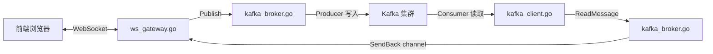
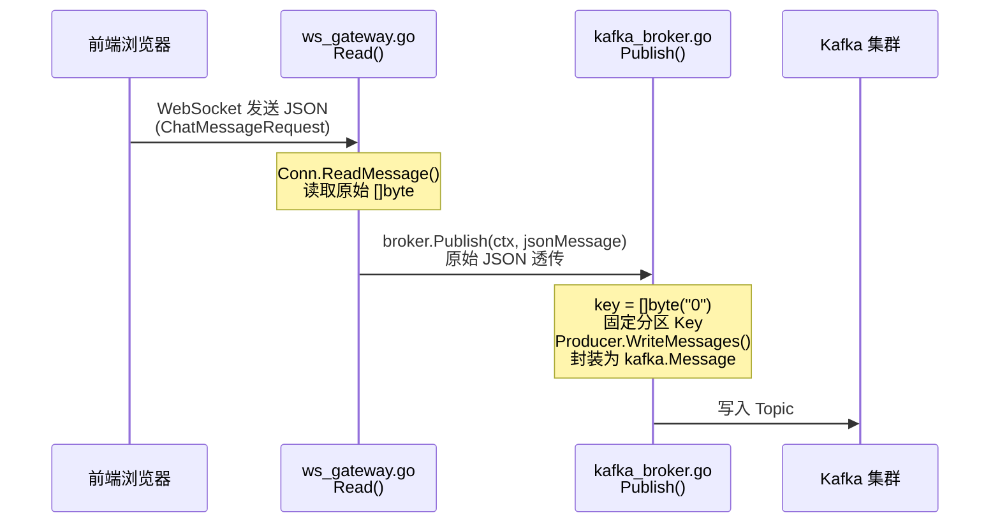
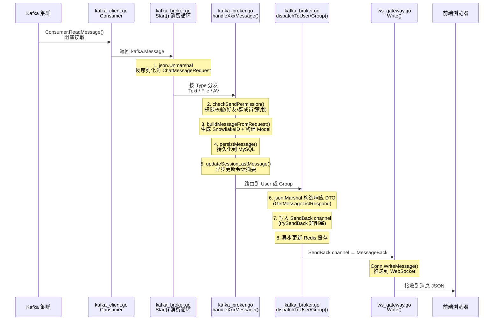
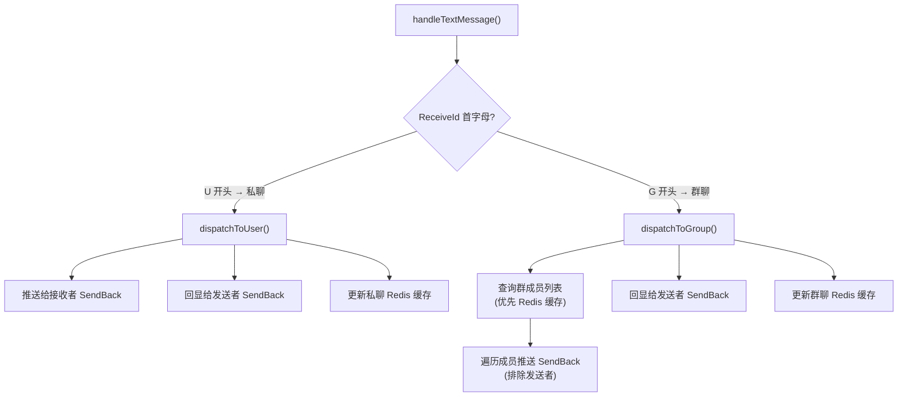

# 聊天消息完整流程

## 整体架构概览

---

## 一、上行链路：用户发送消息 → Kafka

> 前端发出的 JSON 原封不动地写入 Kafka，**不做任何加工**。

### 涉及的代码

| 步骤 | 文件 | 方法 | 作用 |
|------|------|------|------|
| 1 | `ws_gateway.go` | `Read()` | `Conn.ReadMessage()` 阻塞读取 WebSocket 消息 |
| 2 | `ws_gateway.go` | `Read()` | `c.broker.Publish()` 将原始 JSON 传递给 broker |
| 3 | `kafka_broker.go` | `Publish()` | 设置 `key=[]byte("0")`，封装为 `kafka.Message{Key, Value}` 并写入 Kafka |

---

## 二、下行链路：Kafka → 消费 → 推送给用户

> 消息的**所有加工**都发生在这个阶段。

### 涉及的代码

| 步骤 | 文件 | 方法 | 作用 |
|------|------|------|------|
| 1 | `kafka_broker.go` | `Start()` L140 | `Consumer.ReadMessage()` 从 Kafka 拉取消息 |
| 2 | `kafka_broker.go` | `Start()` L158 | `json.Unmarshal` 反序列化为 `ChatMessageRequest` |
| 3 | `kafka_broker.go` | `Start()` L165 | 按 `Type` 分发到 `handleText/File/AV` |
| 4 | `kafka_broker.go` | `handleTextMessage()` L454 | `checkSendPermission()` 权限校验 |
| 5 | `kafka_broker.go` | `handleTextMessage()` L461 | `buildMessageFromRequest()` 构建消息 Model |
| 6 | `kafka_broker.go` | `handleTextMessage()` L470 | `persistMessage()` 持久化 MySQL |
| 7 | `kafka_broker.go` | `dispatchToUser()` L641 | `json.Marshal` 序列化响应 DTO |
| 8 | `kafka_broker.go` | `dispatchToUser()` L657 | `trySendBack()` 写入 `SendBack` channel |
| 9 | `ws_gateway.go` | `Write()` L162 | `Conn.WriteMessage()` 推送到浏览器 |

---

## 三、私聊 vs 群聊 分发差异

---

## 四、关键设计要点

| 设计点 | 说明 |
|--------|------|
| **上行透传** | 前端 JSON 原封不动写入 Kafka，不做序列化/反序列化 |
| **下行加工** | 所有业务逻辑（校验、持久化、路由）集中在消费端 |
| **读写分离** | 每个 WebSocket 连接有独立的 `Read` 和 `Write` goroutine |
| **非阻塞推送** | `trySendBack` 使用 `select-default` 防止 channel 满时阻塞消费者 |
| **心跳保活** | Ping/Pong 机制（54秒发 Ping，60秒 Pong 超时）检测死连接 |
| **缓存优先** | 群成员查询使用 Cache-Aside + singleflight 防击穿 |
