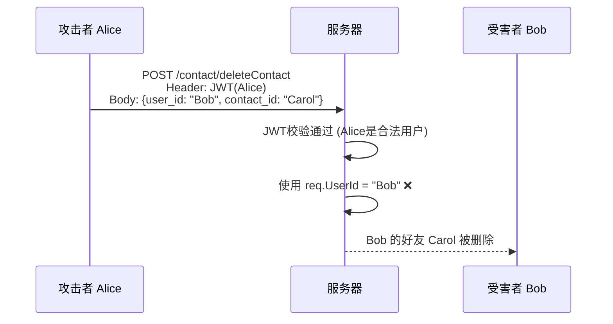

# IDOR 安全漏洞修复报告

## 问题描述

**IDOR (Insecure Direct Object Reference)** 是一种常见的越权漏洞。本项目多个 Handler 存在此漏洞：从请求体 (Request Body) 中读取 `user_id`，而非从 JWT 上下文中获取。

### 风险分析



> [!CAUTION]
> 攻击者只需要一个合法账号，就可以冒充任意其他用户执行敏感操作。

---

## 修复方案

**核心原则**：敏感操作的执行者身份必须从 JWT Token 中解析，绝不信任客户端传递的 `user_id`。

```diff
func (h *ContactHandler) DeleteContact(c *gin.Context) {
+   userId, exists := c.Get("user_id")  // ✅ 从 JWT 上下文获取
+   if !exists {
+       HandleError(c, errorx.New(errorx.CodeUnauthorized, "请先登录"))
+       return
+   }
+
    var req request.DeleteContactRequest
    c.ShouldBindJSON(&req)
    
-   h.contactSvc.DeleteContact(req.UserId, req.ContactId)  // ❌ 不安全
+   h.contactSvc.DeleteContact(userId.(string), req.ContactId)  // ✅ 安全
}
```

---

## 修复清单

共修复 **11 处** IDOR 漏洞：

| Handler | 方法 | 用途 |
|---------|------|------|
| [contact_handler.go](file:///home/Lay/KamaChat/internal/handler/contact_handler.go) | `DeleteContact` | 删除联系人 |
| [contact_handler.go](file:///home/Lay/KamaChat/internal/handler/contact_handler.go) | `BlackContact` | 拉黑联系人 |
| [contact_handler.go](file:///home/Lay/KamaChat/internal/handler/contact_handler.go) | `CancelBlackContact` | 取消拉黑 |
| [apply_handler.go](file:///home/Lay/KamaChat/internal/handler/apply_handler.go) | `ApplyFriend` | 申请好友 |
| [apply_handler.go](file:///home/Lay/KamaChat/internal/handler/apply_handler.go) | `ApplyGroup` | 申请入群 |
| [apply_handler.go](file:///home/Lay/KamaChat/internal/handler/apply_handler.go) | `PassFriendApply` | 通过好友申请 |
| [apply_handler.go](file:///home/Lay/KamaChat/internal/handler/apply_handler.go) | `RefuseFriendApply` | 拒绝好友申请 |
| [apply_handler.go](file:///home/Lay/KamaChat/internal/handler/apply_handler.go) | `BlackFriendApply` | 拉黑好友申请 |
| [session_handler.go](file:///home/Lay/KamaChat/internal/handler/session_handler.go) | `DeleteSession` | 删除会话 |
| [group_handler.go](file:///home/Lay/KamaChat/internal/handler/group_handler.go) | `EnterGroupDirectly` | 直接加入群组 |
| [group_handler.go](file:///home/Lay/KamaChat/internal/handler/group_handler.go) | `LeaveGroup` | 退出群组 |

---

## 验证

```bash
go build ./...  # ✅ 编译通过
```

---

## 编码规范建议

> [!IMPORTANT]
> **新增敏感接口时，必须遵循以下规范：**

1.  **永远从 `c.Get("user_id")` 获取当前用户身份**，不要从请求体中读取。
2.  **Request DTO 中不应包含操作者自身的 `user_id` 字段**，除非业务上确实需要（如管理员操作）。
3.  **管理员接口必须有独立的权限中间件校验**，不能仅靠 JWT 就信任 `is_admin` 字段。
