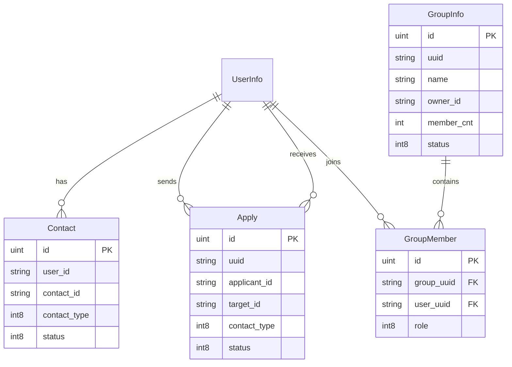

# 07. 好友与群组模型

> 本教程将设计好友、好友申请和群组相关的数据模型。

---

## 📌 学习目标

- 理解即时通讯系统的关系模型
- 设计好友和群组表结构
- 掌握群成员关联表的设计

---

## 1. 模型关系图


```mermaid
erDiagram
    UserInfo ||--o{ Contact : has
  UserInfo ||--o{ Apply : sends
  UserInfo ||--o{ Apply : receives
    UserInfo ||--o{ GroupMember : joins
    GroupInfo ||--o{ GroupMember : contains
    
    Contact {
        uint id PK
        string user_id
        string contact_id
        int8 contact_type
        int8 status
    }
    
    Apply {
        uint id PK
        string uuid
        string applicant_id
        string target_id
        int8 contact_type
        int8 status
    }
    
    GroupInfo {
        uint id PK
        string uuid
        string name
        string owner_id
        int member_cnt
        int8 status
    }
    
    GroupMember {
        uint id PK
        string group_uuid FK
        string user_uuid FK
        int8 role
    }
```

---

## 2. 好友模型

### 2.1 internal/model/contact.go

```go
package model

import (
	"gorm.io/gorm"
)

type Contact struct {
	gorm.Model
	UserId      string `gorm:"column:user_id;index;type:char(20);not null;comment:用户唯一id"`
	ContactId   string `gorm:"column:contact_id;index;type:char(20);not null;comment:好友ID"`
	ContactType int8   `gorm:"column:contact_type;not null;comment:联系类型，0.用户，1.群聊"`
	Status      int8   `gorm:"column:status;not null;comment:联系状态，0.正常，1.拉黑，2.被拉黑，3.删除好友，4.被删除好友，5.被禁言，6.退出群聊，7.被踢出群聊"`
}

func (Contact) TableName() string {
	return "user_contact"
}
```

```sql
CREATE TABLE `user_contact` (
  `id` bigint unsigned AUTO_INCREMENT,
  `created_at` datetime(3) NULL,
  `updated_at` datetime(3) NULL,
  `deleted_at` datetime(3) NULL,
  `user_id` char(20) NOT NULL COMMENT '用户唯一id',
  `contact_id` char(20) NOT NULL COMMENT '好友ID',
  `contact_type` tinyint NOT NULL COMMENT '联系类型，0.用户，1.群聊',
  `status` tinyint NOT NULL COMMENT '联系状态，0.正常，1.拉黑，2.被拉黑，3.删除好友，4.被删除好友，5.被禁言，6.退出群聊，7.被踢出群聊',
  PRIMARY KEY (`id`),
  INDEX `idx_user_contact_deleted_at` (`deleted_at`),
  INDEX `idx_user_contact_user_id` (`user_id`),
  INDEX `idx_user_contact_contact_id` (`contact_id`)
) ENGINE=InnoDB DEFAULT CHARSET=utf8mb4 COMMENT='用户好友表';
```

### 2.2 好友关系说明

| 字段 | 说明 |
|-----|------|
| user_id | 当前用户 ID (发起关系的人) |
| contact_id | 好友 ID（用户或群组） |
| contact_type | 0=用户好友，1=群组好友 |
| status | 关系状态：0.正常，1.拉黑，2.被拉黑，3.删除好友... |

**注意**：好友关系是**双向的**，添加好友时需要创建两条记录。

---

## 3. 好友申请模型

### 3.1 internal/model/apply.go

> **重要变更**：字段名从 `user_id/contacted_id` 更改为 `applicant_id/target_id`，语义更清晰。

```go
package model

import (
	"time"

	"gorm.io/gorm"
)

type Apply struct {
	gorm.Model
	Uuid        string    `gorm:"column:uuid;uniqueIndex;type:char(20);comment:申请id"`
	ApplicantId string    `gorm:"column:applicant_id;index;type:char(20);not null;comment:申请人ID"`
	TargetId    string    `gorm:"column:target_id;index;type:char(20);not null;comment:目标ID(用户/群组)"`
	ContactType int8      `gorm:"column:contact_type;not null;comment:被申请类型，0.用户，1.群聊"`
	Status      int8      `gorm:"column:status;not null;comment:申请状态，0.申请中，1.通过，2.拒绝，3.拉黑"`
	Message     string    `gorm:"column:message;type:varchar(100);comment:申请信息"`
	LastApplyAt time.Time `gorm:"column:last_apply_at;type:datetime;not null;comment:最后申请时间"`
}

func (Apply) TableName() string {
	return "contact_apply"
}
```

```sql
CREATE TABLE `contact_apply` (
  `id` bigint unsigned AUTO_INCREMENT,
  `created_at` datetime(3) NULL,
  `updated_at` datetime(3) NULL,
  `deleted_at` datetime(3) NULL,
  `uuid` char(20) DEFAULT NULL COMMENT '申请id',
  `applicant_id` char(20) NOT NULL COMMENT '申请人ID',
  `target_id` char(20) NOT NULL COMMENT '目标ID(用户/群组)',
  `contact_type` tinyint NOT NULL COMMENT '被申请类型，0.用户，1.群聊',
  `status` tinyint NOT NULL COMMENT '申请状态，0.申请中，1.通过，2.拒绝，3.拉黑',
  `message` varchar(100) DEFAULT NULL COMMENT '申请信息',
  `last_apply_at` datetime NOT NULL COMMENT '最后申请时间',
  PRIMARY KEY (`id`),
  INDEX `idx_contact_apply_deleted_at` (`deleted_at`),
  UNIQUE INDEX `idx_contact_apply_uuid` (`uuid`),
  INDEX `idx_contact_apply_applicant_id` (`applicant_id`),
  INDEX `idx_contact_apply_target_id` (`target_id`)
) ENGINE=InnoDB DEFAULT CHARSET=utf8mb4 COMMENT='好友申请表';
```

### 3.2 字段命名说明

| 旧字段名 | 新字段名 | 说明 |
|---------|---------|------|
| user_id | applicant_id | 申请人 ID，更明确 |
| contacted_id | target_id | 目标 ID（用户或群组），更通用 |

---

## 4. 群组模型

### 4.1 internal/model/group_info.go

```go
package model

import (
	"gorm.io/gorm"
)

type GroupInfo struct {
	gorm.Model
	Uuid      string `gorm:"column:uuid;uniqueIndex;type:char(20);not null;comment:群组唯一id"`
	Name      string `gorm:"column:name;type:varchar(20);not null;comment:群名称"`
	Notice    string `gorm:"column:notice;type:varchar(500);comment:群公告"`
	MemberCnt int    `gorm:"column:member_cnt;default:1;comment:群人数"`
	OwnerId   string `gorm:"column:owner_id;type:char(20);not null;comment:群主uuid"`
	AddMode   int8   `gorm:"column:add_mode;default:0;comment:加群方式，0.直接，1.审核"`
	Avatar    string `gorm:"column:avatar;type:char(255);default:https://cube.elemecdn.com/0/88/03b0d39583f48206768a7534e55bcpng.png;not null;comment:头像"`
	Status    int8   `gorm:"column:status;default:0;comment:状态，0.正常，1.禁用，2.解散"`
}

func (GroupInfo) TableName() string {
	return "group_info"
}
```

```sql
CREATE TABLE `group_info` (
  `id` bigint unsigned AUTO_INCREMENT,
  `created_at` datetime(3) NULL,
  `updated_at` datetime(3) NULL,
  `deleted_at` datetime(3) NULL,
  `uuid` char(20) NOT NULL COMMENT '群组唯一id',
  `name` varchar(20) NOT NULL COMMENT '群名称',
  `notice` varchar(500) DEFAULT NULL COMMENT '群公告',
  `member_cnt` bigint DEFAULT 1 COMMENT '群人数',
  `owner_id` char(20) NOT NULL COMMENT '群主uuid',
  `add_mode` tinyint DEFAULT 0 COMMENT '加群方式，0.直接，1.审核',
  `avatar` char(255) NOT NULL DEFAULT 'https://cube.elemecdn.com/0/88/03b0d39583f48206768a7534e55bcpng.png' COMMENT '头像',
  `status` tinyint DEFAULT 0 COMMENT '状态，0.正常，1.禁用，2.解散',
  PRIMARY KEY (`id`),
  INDEX `idx_group_info_deleted_at` (`deleted_at`),
  UNIQUE INDEX `idx_group_info_uuid` (`uuid`)
) ENGINE=InnoDB DEFAULT CHARSET=utf8mb4 COMMENT='群组信息表';
```

### 4.2 internal/model/group_member.go

> **重要设计说明**
>
> **关联表设计**：使用独立的 `GroupMember` 表存储群成员关系，而不是在 `GroupInfo` 中使用 JSON 字段。

**设计优势**：
- ✅ 支持并发安全的成员增删
- ✅ 高效查询"我加入的群"（通过索引）
- ✅ 可以存储成员角色等额外信息
- ✅ 便于实现群成员管理功能（踢人、设置管理员等）

```go
package model

import "gorm.io/gorm"

// GroupMember 群成员关联表
type GroupMember struct {
	gorm.Model
	GroupUuid string `gorm:"type:char(20);index;not null;comment:群组ID"`
	UserUuid  string `gorm:"type:char(20);index;not null;comment:用户ID"`
	Role      int8   `gorm:"default:1;comment:1普通成员 2管理员 3群主"`
}

func (GroupMember) TableName() string {
	return "group_member"
}
```

```sql
CREATE TABLE `group_member` (
  `id` bigint unsigned AUTO_INCREMENT,
  `created_at` datetime(3) NULL,
  `updated_at` datetime(3) NULL,
  `deleted_at` datetime(3) NULL,
  `group_uuid` char(20) NOT NULL COMMENT '群组ID',
  `user_uuid` char(20) NOT NULL COMMENT '用户ID',
  `role` tinyint DEFAULT 1 COMMENT '1普通成员 2管理员 3群主',
  PRIMARY KEY (`id`),
  INDEX `idx_group_member_deleted_at` (`deleted_at`),
  INDEX `idx_group_member_group_uuid` (`group_uuid`),
  INDEX `idx_group_member_user_uuid` (`user_uuid`)
) ENGINE=InnoDB DEFAULT CHARSET=utf8mb4 COMMENT='群成员关联表';
```

**字段说明**：

| 字段 | 类型 | 说明 |
|-----|------|------|
| group_uuid | char(20) | 群组 UUID，建立索引 |
| user_uuid | char(20) | 用户 UUID，建立索引 |
| role | int8 | 成员角色：1=普通成员，2=管理员，3=群主 |

**常见查询**：

```go
// 查询某个群的所有成员
groupMemberRepo.FindByGroupUuid(groupUuid)

// 查询用户加入的所有群
groupMemberRepo.FindByUserUuid(userUuid)

// 检查用户是否在群中
groupMemberRepo.FindByGroupAndUser(groupUuid, userUuid)
```

---

## 5. 数据库自动迁移

我们的 `internal/dao/mysql/init_mysql.go` 中的 `Init` 函数会自动处理迁移，并返回 `*mysql.Repositories`（不再使用全局变量）：

```go
package mysql

import (
  "kama_chat_server/internal/dao/mysql"
  "kama_chat_server/internal/model"
)

func Init() *mysql.Repositories {
  // ... 连接数据库 ...

  err := db.AutoMigrate(
    &model.UserInfo{},
    &model.GroupInfo{},
    &model.Contact{},
    &model.Session{},
    &model.Apply{},
    &model.Message{},
    &model.GroupMember{},
  )
  if err != nil {
    // ... fatal log ...
  }

  return repository.NewRepositories(db)
}
```

只要在 `model` 包下定义好结构体，并添加到 `AutoMigrate` 列表中，重启服务即可自动建表。

---

## 6. 运行迁移

```bash
cd cmd/kama_chat_server
go run main.go
```

验证新表：
```sql
SHOW TABLES;
```

输出：
```
+----------------------+
| Tables_in_kama_chat  |
+----------------------+
| contact_apply        |
| group_info           |
| group_member         |
| user_contact         |
| user_info            |
+----------------------+
```

---

## ✅ 本节完成

你已经完成了：
- [x] Contact 好友模型
- [x] Apply 好友/入群申请模型（使用 applicant_id/target_id）
- [x] GroupInfo 群组模型
- [x] GroupMember 群成员关联表

---

## 📚 下一步

继续学习 [08_会话与消息模型.md](08_会话与消息模型.md)，设计会话和消息模型。
