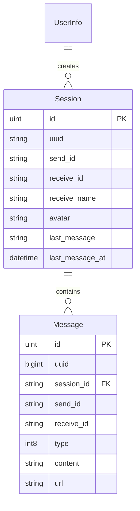

# 08. 会话与消息模型

> 本教程将设计会话和消息模型，这是即时通讯系统的核心数据结构。

---

## 📌 学习目标

- 理解会话和消息的关系
- 设计支持多种消息类型的模型
- 掌握消息存储最佳实践

---

## 1. 会话与消息的关系



**概念说明**：
- **会话（Session）**：用户与某个联系人/群组的聊天窗口
- **消息（Message）**：会话中的具体消息内容

---

## 2. 会话模型

### 2.1 internal/model/session.go

```go
package model

import (
	"database/sql"

	"gorm.io/gorm"
)

type Session struct {
	gorm.Model
	Uuid          string       `gorm:"column:uuid;uniqueIndex;type:char(20);comment:会话uuid"`
	SendId        string       `gorm:"column:send_id;index;type:char(20);not null;comment:创建会话人id"`
	ReceiveId     string       `gorm:"column:receive_id;index;type:char(20);not null;comment:接受会话人id"`
	ReceiveName   string       `gorm:"column:receive_name;type:varchar(20);not null;comment:名称"`
	Avatar        string       `gorm:"column:avatar;type:char(255);default:default_avatar.png;not null;comment:头像"`
	LastMessage   string       `gorm:"column:last_message;type:TEXT;comment:最新的消息"`
	LastMessageAt sql.NullTime `gorm:"column:last_message_at;type:datetime;comment:最近接收时间"`
}

func (Session) TableName() string {
	return "session"
}
```

```sql
CREATE TABLE `session` (
  `id` bigint unsigned AUTO_INCREMENT,
  `created_at` datetime(3) NULL,
  `updated_at` datetime(3) NULL,
  `deleted_at` datetime(3) NULL,
  `uuid` char(20) DEFAULT NULL COMMENT '会话uuid',
  `send_id` char(20) NOT NULL COMMENT '创建会话人id',
  `receive_id` char(20) NOT NULL COMMENT '接受会话人id',
  `receive_name` varchar(20) NOT NULL COMMENT '名称',
  `avatar` char(255) NOT NULL DEFAULT 'default_avatar.png' COMMENT '头像',
  `last_message` TEXT DEFAULT NULL COMMENT '最新的消息',
  `last_message_at` datetime DEFAULT NULL COMMENT '最近接收时间',
  PRIMARY KEY (`id`),
  INDEX `idx_session_deleted_at` (`deleted_at`),
  UNIQUE INDEX `idx_session_uuid` (`uuid`),
  INDEX `idx_session_send_id` (`send_id`),
  INDEX `idx_session_receive_id` (`receive_id`)
) ENGINE=InnoDB DEFAULT CHARSET=utf8mb4 COMMENT='会话表';
```

### 2.2 会话设计说明

| 字段 | 说明 | 示例 |
|-----|------|------|
| send_id | 会话创建者（当前用户） | U123... |
| receive_id | 聊天对象（用户或群组） | U456...（用户）或 G789...（群组） |
| receive_name | 对方昵称/群名（冗余存储） | "张三" 或 "工作群" |
| avatar | 对方头像（冗余存储） | avatar.png |
| last_message | 最新消息内容预览 | "你好" |
| last_message_at | 最后消息时间（用于排序） | 2024-01-01 10:00:00 |

**冗余字段的作用**：
- `receive_name` 和 `avatar`：显示会话列表时无需 JOIN 用户/群组表
- `last_message` 和 `last_message_at`：会话列表排序和预览

**注意**：每个用户对同一个聊天对象只有一个会话记录。

---

## 3. 消息模型

### 3.1 internal/model/message.go

> **当前仓库的真实形态**：`Uuid` 使用雪花算法生成的 `int64`（数据库 `bigint`），同时 `pkg/util/snowflake` 也提供 `GenerateIDString()` 以避免前端 JavaScript 精度丢失。

```go
package model

import (
	"database/sql"

	"gorm.io/gorm"
)

type Message struct {
	gorm.Model
	Uuid       int64        `gorm:"column:uuid;uniqueIndex;type:bigint;not null;comment:消息雪花ID"`
	SessionId  string       `gorm:"column:session_id;index;type:char(20);not null;comment:会话uuid"`
	Type       int8         `gorm:"column:type;not null;comment:消息类型，0.文本，1.语音，2.文件，3.通话"`
	Content    string       `gorm:"column:content;type:TEXT;comment:消息内容"`
	Url        string       `gorm:"column:url;type:char(255);comment:消息url"`
	SendId     string       `gorm:"column:send_id;index;type:char(20);not null;comment:发送者uuid"`
	SendName   string       `gorm:"column:send_name;type:varchar(20);not null;comment:发送者昵称"`
	SendAvatar string       `gorm:"column:send_avatar;type:varchar(255);not null;comment:发送者头像"`
    ReceiveId  string       `gorm:"column:receive_id;index;type:char(20);not null;comment:接受者uuid"`
    FileType   string       `gorm:"column:file_type;type:char(50);comment:文件类型"`
	FileName   string       `gorm:"column:file_name;type:varchar(50);comment:文件名"`
	FileSize   string       `gorm:"column:file_size;type:char(20);comment:文件大小"`
	Status     int8         `gorm:"column:status;not null;comment:状态，0.未发送，1.已发送"`
	SendAt     sql.NullTime `gorm:"column:send_at;comment:发送时间"`
	AVdata     string       `gorm:"column:av_data;comment:通话传递数据"`
}

func (Message) TableName() string {
	return "message"
}
```

```sql
CREATE TABLE `message` (
  `id` bigint unsigned AUTO_INCREMENT,
  `created_at` datetime(3) NULL,
  `updated_at` datetime(3) NULL,
  `deleted_at` datetime(3) NULL,
  `uuid` bigint NOT NULL COMMENT '消息雪花ID',
  `session_id` char(20) NOT NULL COMMENT '会话uuid',
  `type` tinyint NOT NULL COMMENT '消息类型，0.文本，1.语音，2.文件，3.通话',
  `content` TEXT DEFAULT NULL COMMENT '消息内容',
  `url` char(255) DEFAULT NULL COMMENT '消息url',
  `send_id` char(20) NOT NULL COMMENT '发送者uuid',
  `send_name` varchar(20) NOT NULL COMMENT '发送者昵称',
  `send_avatar` varchar(255) NOT NULL COMMENT '发送者头像',
  `receive_id` char(20) NOT NULL COMMENT '接受者uuid',
    `file_type` char(50) DEFAULT NULL COMMENT '文件类型',
  `file_name` varchar(50) DEFAULT NULL COMMENT '文件名',
  `file_size` char(20) DEFAULT NULL COMMENT '文件大小',
  `status` tinyint NOT NULL COMMENT '状态，0.未发送，1.已发送',
  `send_at` datetime DEFAULT NULL COMMENT '发送时间',
    `av_data` varchar(255) DEFAULT NULL COMMENT '通话传递数据',
  PRIMARY KEY (`id`),
  UNIQUE INDEX `idx_message_uuid` (`uuid`),
  INDEX `idx_message_session_id` (`session_id`),
  INDEX `idx_message_send_id` (`send_id`),
  INDEX `idx_message_receive_id` (`receive_id`)
) ENGINE=InnoDB DEFAULT CHARSET=utf8mb4 COMMENT='消息表';
```

### 3.2 消息类型枚举

`pkg/enum/message/message_type_enum/message_type_enum.go`：

```go
package message_type_enum

const (
    Text = iota
    // 语音
    Voice
    // 文件
    File
    // 通话
    AudioOrVideo
)
```

### 3.3 消息状态枚举

`pkg/enum/message/message_status_enum/message_status_enum.go`：

```go
package message_status_enum

const (
    // 未发送
    Unsent = iota
    // 已发送
    Sent
)
```

---

## 4. 消息模型设计详解

### 4.1 雪花算法 ID

消息使用雪花算法生成唯一 ID，优势：
- **有序性**：ID 按时间递增，便于排序
- **高性能**：本地生成，无需数据库查询
- **分布式**：支持多节点同时生成

配置位置：`configs/config.toml`
```toml
[snowflakeConfig]
machineId = 1  # 雪花算法节点 ID (0-1023)
```

使用方式（当前实现）：

```go
import "kama_chat_server/pkg/util/snowflake"

// 建议在 main 启动时初始化一次
snowflake.Init()

// 生成 int64 ID（落库 bigint）
messageId := snowflake.GenerateID()

// 如果要返回给前端（JS 可能丢精度），建议返回 string
messageIdStr := snowflake.GenerateIDString()
```

### 4.2 多种消息类型支持

| 类型 | Type | 使用字段 |
|-----|------|---------| 
| 文本 | 0 | content |
| 语音 | 1 | url, file_size |
| 文件 | 2 | url, file_size, file_type, file_name |
| 通话 | 3 | av_data（JSON 格式） |

### 4.3 为什么冗余存储 SendName 和 SendAvatar

```go
SendName   string `gorm:"column:send_name"`
SendAvatar string `gorm:"column:send_avatar"`
```

**原因**：
1. **减少关联查询**：显示消息时无需 JOIN 用户表
2. **历史快照**：保留发送时的昵称/头像，即使后来用户修改了也不影响历史消息
3. **性能优化**：消息量大时，避免频繁查询用户信息

### 4.4 SessionId 的作用

- 关联消息与会话
- 方便按会话查询消息历史
- 支持消息分页加载

---

## 5. 音视频数据结构

### 5.1 AVData JSON 结构

```go
// internal/dto/request/av_data_request.go
type AVData struct {
    MessageId string `json:"messageId"`
    Type      string `json:"type"`
}
```

---

## 6. 更新迁移函数

我们已经在 `internal/dao/mysql/init_mysql.go` 中配置了所有模型的自动迁移（并且不再使用全局 `GormDB/Repos`）：

```go
package mysql

import (
    "kama_chat_server/internal/dao/mysql/repository"
    "kama_chat_server/internal/model"
)

// Init 初始化数据库连接，自动迁移，并返回 Repositories
func Init() *repository.Repositories {
    // ... 连接数据库 ...

    err := db.AutoMigrate(
        &model.UserInfo{},
        &model.GroupInfo{},
        &model.Contact{},
        &model.Session{},
        &model.Apply{},
        &model.Message{},
        &model.GroupMember{},
    )
    if err != nil {
        // ... fatal log ...
    }

    return repository.NewRepositories(db)
}
```

只需运行 `main.go` 即可应用更改。

---

## 7. 完整枚举目录结构

```
pkg/enum/
├── contact/
│   ├── contact_status_enum/
│   │   └── contact_status_enum.go    # 联系人状态
│   └── contact_type_enum/
│       └── contact_type_enum.go      # 联系人类型
├── contact_apply/
│   └── contact_apply_status_enum/
│       └── contact_apply_status_enum.go  # 申请状态
├── group_info/
│   ├── add_mode_enum/
│   │   └── add_mode_enum.go          # 加群方式
│   └── group_status_enum/
│       └── group_status_enum.go      # 群组状态
├── message/
│   ├── message_status_enum/
│   │   └── message_status_enum.go    # 消息状态
│   └── message_type_enum/
│       └── message_type_enum.go      # 消息类型
└── user_info/
    └── user_status_enum/
        └── user_status_enum.go        # 用户状态
```

**枚举命名规范**：
- 目录名使用下划线分隔：`contact_apply_status_enum`
- 文件名与目录名一致
- 包名与目录名一致
- 常量使用大驼峰命名

---

## 8. 运行迁移

```bash
cd cmd/kama_chat_server
go run main.go
```

验证所有表：
```sql
USE kama_chat;
SHOW TABLES;
```

预期输出：
```
+----------------------+
| Tables_in_kama_chat  |
+----------------------+
| contact_apply        |
| group_info           |
| group_member         |
| message              |
| session              |
| user_contact         |
| user_info            |
+----------------------+
```

查看消息表结构：
```sql
DESCRIBE message;
```

---

## ✅ 本节完成

你已经完成了：
- [x] Session 会话模型（含冗余字段）
- [x] Message 消息模型（雪花 ID）
- [x] 消息类型/状态枚举
- [x] 音视频消息结构

---

## 📚 阶段二完成！

恭喜！你已经完成了 **阶段二：数据模型层**。

继续学习 [09_Gin框架搭建与路由.md](09_Gin框架搭建与路由.md)，开始 **阶段三：HTTP API 服务**。
