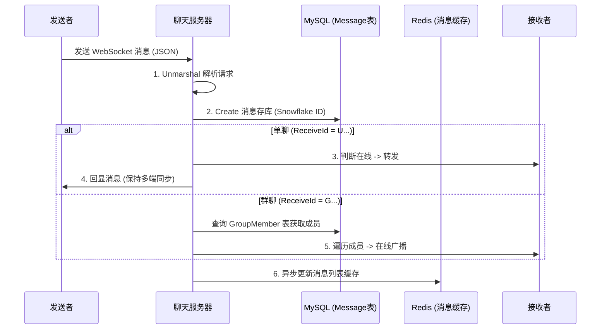

# 17. 单聊与群聊消息处理

> 本教程将完善消息处理逻辑，实现单聊和群聊的消息解析、持久化存储以及在线转发。

---

## 📌 学习目标

- 实现消息请求 DTO 解析
- 消息持久化到 MySQL（使用雪花 ID）
- 实现单聊点对点转发
- 实现群聊广播转发（查询 GroupMember 表）
- 理解在线回显与 Redis 缓存策略

---

## 1. 消息业务流程



---

## 2. 代码位置说明

> **代码位置**：`internal/service/chat/channel_server.go`
>
> **重要变更**：
> - 消息 UUID 使用雪花算法生成的 `int64` 类型
> - 使用 `sync.Map` 管理在线客户端
> - Redis 更新采用异步 goroutine

---

## 3. 文本消息处理

### 3.1 handleTextMessage 方法

```go
// handleTextMessage 处理文本消息
func (s *StandaloneServer) handleTextMessage(req request.ChatMessageRequest) {
	// 1. 构建数据库模型对象
	message := model.Message{
		Uuid:       snowflake.GenerateID(),     // 雪花算法生成唯一ID (int64)
		SessionId:  req.SessionId,
		Type:       req.Type,
		Content:    req.Content,
		Url:        "",
		SendId:     req.SendId,
		SendName:   req.SendName,
		SendAvatar: req.SendAvatar,
		ReceiveId:  req.ReceiveId,
		FileSize:   "0B",
		FileType:   "",
		FileName:   "",
		Status:     message_status_enum.Unsent,
		CreatedAt:  time.Now(),
		AVdata:     "",
	}
	// 规范化头像路径
	message.SendAvatar = normalizePath(message.SendAvatar)

	// 2. 存入 MySQL 数据库
	if res := dao.GormDB.Create(&message); res.Error != nil {
		zap.L().Error(res.Error.Error())
	}

	// 3. 根据 ReceiveId 前缀判断单聊/群聊
	if message.ReceiveId[0] == 'U' {
		s.sendToUser(message, req.SendAvatar)
	} else if message.ReceiveId[0] == 'G' {
		s.sendToGroup(message, req.SendAvatar)
	}
}
```

---

## 4. 单聊消息转发

### 4.1 sendToUser 方法

```go
// sendToUser 发送消息给单个用户
func (s *StandaloneServer) sendToUser(message model.Message, originalAvatar string) {
	// 1. 构造返回给前端的响应体
	messageRsp := respond.GetMessageListRespond{
		SendId:     message.SendId,
		SendName:   message.SendName,
		SendAvatar: originalAvatar,
		ReceiveId:  message.ReceiveId,
		Type:       message.Type,
		Content:    message.Content,
		Url:        message.Url,
		FileSize:   message.FileSize,
		FileName:   message.FileName,
		FileType:   message.FileType,
		CreatedAt:  message.CreatedAt.Format("2006-01-02 15:04:05"),
	}

	// 2. 序列化为 JSON
	jsonMessage, err := json.Marshal(messageRsp)
	if err != nil {
		zap.L().Error(err.Error())
	}

	// 3. 封装为 MessageBack 对象
	messageBack := &MessageBack{
		Message: jsonMessage,
		Uuid:    message.Uuid,  // 雪花 ID (int64)
	}

	// 4. 消息投递 (sync.Map 自动处理并发安全)
	// 给接收者发
	if value, ok := s.Clients.Load(message.ReceiveId); ok {
		receiveClient := value.(*UserConn)
		receiveClient.SendBack <- messageBack
	}
	// 给发送者回显
	if value, ok := s.Clients.Load(message.SendId); ok {
		sendClient := value.(*UserConn)
		sendClient.SendBack <- messageBack
	}

	// 5. 异步更新 Redis 缓存
	go s.updateRedisUser(message, messageRsp)
}
```

**单聊消息流程**：
```
1. 构建 Message 对象 → 存入 MySQL
   ↓
2. 构建 GetMessageListRespond 响应
   ↓
3. 检查接收者是否在线 → 发送到 receiveClient.SendBack
   ↓
4. 发送回显给发送者 → 发送到 sendClient.SendBack
   ↓
5. 异步更新 Redis 缓存：message_list_{sendId}_{receiveId}
```

**为什么要回显**：
- 发送者可能有多个设备在线（手机+电脑）
- 保证所有设备的消息列表同步

---

## 5. 群聊消息广播

### 5.1 sendToGroup 方法

```go
// sendToGroup 发送消息给群组
func (s *StandaloneServer) sendToGroup(message model.Message, originalAvatar string) {
	// 1. 构造群聊响应体
	messageRsp := respond.GetGroupMessageListRespond{
		SendId:     message.SendId,
		SendName:   message.SendName,
		SendAvatar: originalAvatar,
		ReceiveId:  message.ReceiveId,
		Type:       message.Type,
		Content:    message.Content,
		Url:        message.Url,
		FileSize:   message.FileSize,
		FileName:   message.FileName,
		FileType:   message.FileType,
		CreatedAt:  message.CreatedAt.Format("2006-01-02 15:04:05"),
	}

	// 2. 序列化
	jsonMessage, _ := json.Marshal(messageRsp)
	messageBack := &MessageBack{
		Message: jsonMessage,
		Uuid:    message.Uuid,
	}

	// 3. 查询群成员列表
	var groupMembers []model.GroupMember
	if res := dao.GormDB.Where("group_uuid = ?", message.ReceiveId).Find(&groupMembers); res.Error != nil {
		zap.L().Error(res.Error.Error())
	}

	// 4. 分发消息 (sync.Map 自动处理并发安全)
	for _, gm := range groupMembers {
		if gm.UserUuid != message.SendId {
			// 给其他成员推送
			if value, ok := s.Clients.Load(gm.UserUuid); ok {
				receiveClient := value.(*UserConn)
				receiveClient.SendBack <- messageBack
			}
		} else {
			// 给自己(发送者)推送回显
			if value, ok := s.Clients.Load(message.SendId); ok {
				sendClient := value.(*UserConn)
				sendClient.SendBack <- messageBack
			}
		}
	}

	// 5. 异步更新 Redis 缓存
	go s.updateRedisGroup(message, messageRsp)
}
```

**群聊消息流程**：
```
1. 构建 Message 对象 → 存入 MySQL
   ↓
2. 查询 GroupMember 表获取所有成员
   ↓
3. 遍历成员列表：
   - 成员在线 → 发送到 client.SendBack
   - 成员离线 → 跳过（下次登录从数据库拉取）
   ↓
4. 异步更新 Redis 缓存：group_messagelist_{groupId}
```

---

## 6. 文件与音视频消息

### 6.1 文件消息

```go
func (s *StandaloneServer) handleFileMessage(req request.ChatMessageRequest) {
	message := model.Message{
		Uuid:       snowflake.GenerateID(),
		// ...
		Content:    "",        // 文件消息内容为空
		Url:        req.Url,   // 存储文件链接
		FileSize:   req.FileSize,
		FileType:   req.FileType,
		FileName:   req.FileName,
	}
	// 存库 + 转发逻辑同文本消息
}
```

### 6.2 音视频消息

```go
func (s *StandaloneServer) handleAVMessage(req request.ChatMessageRequest) {
	var avData request.AVData
	json.Unmarshal([]byte(req.AVdata), &avData)

	message := model.Message{
		Uuid:   snowflake.GenerateID(),
		AVdata: req.AVdata,
		// ...
	}

	// 只有特定信令类型会入库
	if avData.MessageId == "PROXY" && (avData.Type == "start_call" || avData.Type == "receive_call" || avData.Type == "reject_call") {
		dao.GormDB.Create(&message)
	}

	// 转发逻辑（不回显给发送者）
	// ...
}
```

---

## 7. Redis 缓存策略

### 7.1 异步更新缓存

```go
// updateRedisUser 更新用户间聊天记录的 Redis 缓存
func (s *StandaloneServer) updateRedisUser(message model.Message, rsp respond.GetMessageListRespond) {
	key := "message_list_" + message.SendId + "_" + message.ReceiveId
	rspString, err := myredis.GetKeyNilIsErr(key)
	if err == nil {
		var list []respond.GetMessageListRespond
		if json.Unmarshal([]byte(rspString), &list) == nil {
			list = append(list, rsp)
			if rspByte, err := json.Marshal(list); err == nil {
				myredis.SetKeyEx(key, string(rspByte), time.Minute*constants.REDIS_TIMEOUT)
			}
		}
	} else if !errors.Is(err, redis.Nil) {
		zap.L().Error(err.Error())
	}
}
```

**缓存键规范**：
- 单聊：`message_list_{sendId}_{receiveId}`
- 群聊：`group_messagelist_{groupId}`

---

## 8. 测试消息收发

### 8.1 测试单聊

```json
{
    "type": 0,
    "content": "Hello B",
    "sendId": "U_AAAA",
    "sendName": "张三",
    "sendAvatar": "/static/avatars/xxx.jpg",
    "receiveId": "U_BBBB",
    "sessionId": "S_xxxx"
}
```

### 8.2 测试群聊

```json
{
    "type": 0,
    "content": "Hello Group",
    "sendId": "U_AAAA",
    "sendName": "张三",
    "sendAvatar": "/static/avatars/xxx.jpg",
    "receiveId": "G_CCCC",
    "sessionId": "S_yyyy"
}
```

---

## ✅ 本节完成

你已经完成了：
- [x] 消息模型持久化（MySQL + 雪花 ID）
- [x] 头像路径规范化处理
- [x] 单聊在线转发与回显（sync.Map）
- [x] 群聊成员广播（GroupMember 表查询）
- [x] Redis 缓存异步更新
- [x] 文件和音视频消息处理

---

## 📚 下一步

继续学习 [18_Kafka集成与消息模式.md](18_Kafka集成与消息模式.md)，了解 Kafka 模式的实现。
