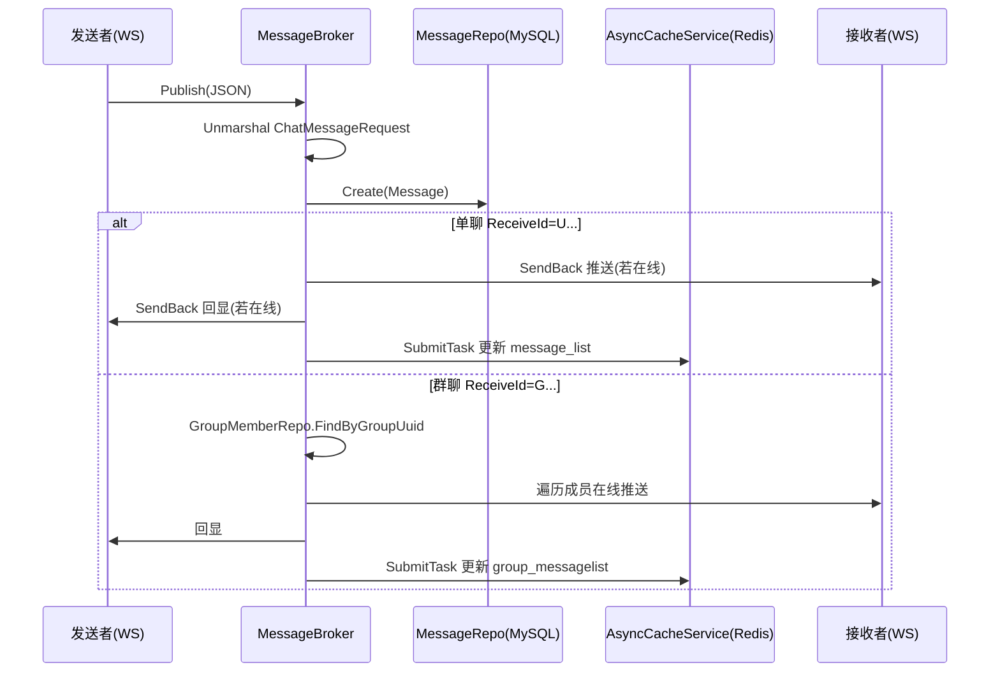

# 17. 单聊与群聊消息处理

> 本章以当前代码为准，讲清楚消息从 WebSocket 进入后，如何在 Broker 内完成：解析 → 入库 → 单聊/群聊转发 → 异步更新缓存。

---

## 📌 学习目标

- 理解消息处理的入口：`StandaloneServer.Start()` / `MsgConsumer.Start()`
- 掌握文本/文件/音视频信令三类消息的处理差异
- 理解单聊点对点推送与“发送者回显”的目的
- 理解群聊广播：通过 GroupMemberRepository 查询成员并在线推送
- 理解 Redis 缓存更新：通过注入的 `AsyncCacheService.SubmitTask()` 异步执行

---

## 1. 代码位置说明（以当前实现为准）

- Channel 模式（单机）：`internal/service/chat/channel_broker.go`
- Kafka 模式（分布式）：`internal/service/chat/kafka_broker.go`

两种模式的“业务处理函数”结构非常相近：

- `handleTextMessage()` / `handleFileMessage()` / `handleAVMessage()`
- `sendToUser()` / `sendToGroup()`

---

## 2. 消息业务流程（高层）



---

## 3. DTO：ChatMessageRequest（请求体）

> DTO 定义在：`internal/dto/request/chat_message_request.go`

重点字段（只列核心）：

- `session_id`：会话ID
- `type`：消息类型（枚举值见下）
- `content/url/file_size/file_type/file_name/av_data`：不同类型消息使用不同字段
- `send_id` / `receive_id`：发送方/接收方（`U...` 单聊用户、`G...` 群聊）

消息类型枚举（以代码为准）：

- `0`：Text
- `1`：Voice
- `2`：File
- `3`：AudioOrVideo

---

## 4. 文本消息：handleTextMessage

Channel 模式实现（Kafka 模式同理）：

```go
// internal/service/chat/channel_broker.go

func (s *StandaloneServer) handleTextMessage(req request.ChatMessageRequest) {
    message := model.Message{
        Uuid:       snowflake.GenerateID(),
        SessionId:  req.SessionId,
        Type:       req.Type,
        Content:    req.Content,
        Url:        "",
        SendId:     req.SendId,
        SendName:   req.SendName,
        SendAvatar: req.SendAvatar,
        ReceiveId:  req.ReceiveId,
        FileSize:   "0B",
        FileType:   "",
        FileName:   "",
        Status:     message_status_enum.Unsent,
        AVdata:     "",
    }

    // 规范化头像路径
    message.SendAvatar = normalizePath(message.SendAvatar)

    // 通过 Repository 入库（依赖倒置）
    if s.messageRepo != nil {
        _ = s.messageRepo.Create(&message)
    }

    // 根据 ReceiveId 前缀路由
    if message.ReceiveId[0] == 'U' {
        s.sendToUser(message, req.SendAvatar)
    } else if message.ReceiveId[0] == 'G' {
        s.sendToGroup(message, req.SendAvatar)
    }
}
```

要点：

- UUID 使用雪花算法生成 `int64`
- 入库使用 `MessageRepository.Create()`，不在 Broker 内直接调用 Gorm

---

## 5. 单聊转发：sendToUser（推送 + 回显 + 缓存）

```go
// internal/service/chat/channel_broker.go

func (s *StandaloneServer) sendToUser(message model.Message, originalAvatar string) {
    rsp := respond.GetMessageListRespond{
        SendId:     message.SendId,
        SendName:   message.SendName,
        SendAvatar: originalAvatar,
        ReceiveId:  message.ReceiveId,
        Type:       message.Type,
        Content:    message.Content,
        Url:        message.Url,
        FileSize:   message.FileSize,
        FileName:   message.FileName,
        FileType:   message.FileType,
        CreatedAt:  message.CreatedAt.Format("2006-01-02 15:04:05"),
    }

    jsonMessage, _ := json.Marshal(rsp)
    back := &MessageBack{Message: jsonMessage, Uuid: message.Uuid}

    // 1) 推给接收者（若在线）
    if v, ok := s.Clients.Load(message.ReceiveId); ok {
        v.(*UserConn).SendBack <- back
    }
    // 2) 回显给发送者（若在线）
    if v, ok := s.Clients.Load(message.SendId); ok {
        v.(*UserConn).SendBack <- back
    }

    // 3) 异步更新缓存
    if s.cacheService != nil {
        s.cacheService.SubmitTask(func() {
            userOne := message.SendId
            userTwo := message.ReceiveId
            if userOne > userTwo {
                userOne, userTwo = userTwo, userOne
            }
            key := "message_list_" + userOne + "_" + userTwo
            // GetOrError -> append -> Set
        })
    }
}
```

为什么要“回显”：

- 发送者可能多端在线（手机/电脑），回显能保证自己所有端消息列表同步

缓存 Key（以代码为准）：

- 单聊：`message_list_<userOne>_<userTwo>`（先按字符串大小排序，保证同一对用户只有一个 key）

---

## 6. 群聊广播：sendToGroup（成员查询 + 广播 + 缓存）

群聊与单聊的关键差异：

1. 需要先查询成员列表
2. 对每个成员判断是否在线，在线才推送

```go
// internal/service/chat/channel_broker.go

func (s *StandaloneServer) sendToGroup(message model.Message, originalAvatar string) {
    rsp := respond.GetGroupMessageListRespond{
        SendId:     message.SendId,
        SendName:   message.SendName,
        SendAvatar: originalAvatar,
        ReceiveId:  message.ReceiveId,
        Type:       message.Type,
        Content:    message.Content,
        Url:        message.Url,
        FileSize:   message.FileSize,
        FileName:   message.FileName,
        FileType:   message.FileType,
        CreatedAt:  message.CreatedAt.Format("2006-01-02 15:04:05"),
    }
    jsonMessage, _ := json.Marshal(rsp)
    back := &MessageBack{Message: jsonMessage, Uuid: message.Uuid}

    // 通过 Repository 查询群成员
    var members []model.GroupMember
    if s.groupMemberRepo != nil {
        members, _ = s.groupMemberRepo.FindByGroupUuid(message.ReceiveId)
    }

    // 在线推送
    for _, gm := range members {
        if gm.UserUuid != message.SendId {
            if v, ok := s.Clients.Load(gm.UserUuid); ok {
                v.(*UserConn).SendBack <- back
            }
        } else {
            // 回显给自己
            if v, ok := s.Clients.Load(message.SendId); ok {
                v.(*UserConn).SendBack <- back
            }
        }
    }

    // 异步更新群聊缓存
    if s.cacheService != nil {
        s.cacheService.SubmitTask(func() {
            key := "group_messagelist_" + message.ReceiveId
            // GetOrError -> append -> Set
        })
    }
}
```

缓存 Key（以代码为准）：

- 群聊：`group_messagelist_<groupUuid>`（注意这里的 `<groupUuid>` 实际是 `ReceiveId`，形如 `Gxxxx`）

---

## 7. 文件消息与音视频信令

### 7.1 文件消息：handleFileMessage

与文本消息主要差异：

- `Content` 为空
- `Url/FileSize/FileType/FileName` 会被写入

### 7.2 音视频信令：handleAVMessage

以当前实现为准：

- `av_data` 会被反序列化为 `AVData`
- 只有当 `MessageId == "PROXY"` 且 `Type` 属于 `start_call/receive_call/reject_call` 时才会入库
- 信令一般只转发给接收者，不回显给发送者（避免前端重复触发）

---

## 8. 测试消息收发（注意字段是 snake_case）

### 8.1 测试单聊文本

```json
{
  "session_id": "S_123",
  "type": 0,
  "content": "Hello B",
  "send_id": "U_AAAA",
  "send_name": "张三",
  "send_avatar": "/static/avatars/xxx.jpg",
  "receive_id": "U_BBBB"
}
```

### 8.2 测试群聊文本

```json
{
  "session_id": "S_456",
  "type": 0,
  "content": "Hello Group",
  "send_id": "U_AAAA",
  "send_name": "张三",
  "send_avatar": "/static/avatars/xxx.jpg",
  "receive_id": "G_CCCC"
}
```

---

## ✅ 本章小结

- 消息处理发生在 Broker 内：解析 → 入库 → 路由推送 → 异步缓存更新
- 单聊：推送给接收者 + 回显给发送者；缓存 key 会对两端用户 id 排序
- 群聊：通过 `GroupMemberRepository` 查询成员，在线广播；缓存 key 为 `group_messagelist_<groupUuid>`

下一章进入 Kafka 模式：消息如何发布到 Kafka、消费并路由到本机在线用户。
