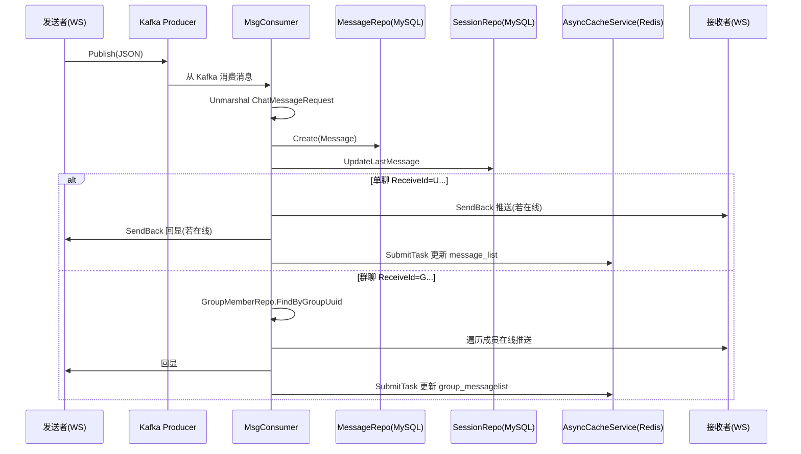

# 17. 单聊与群聊消息处理

> 本章以当前代码为准，讲清楚消息从 WebSocket 进入后，如何在 Kafka Broker（MsgConsumer）内完成：解析 → 入库 → 单聊/群聊转发 → 异步更新缓存。

---

## 📌 学习目标

- 理解消息处理的入口：`MsgConsumer.Start()`
- 掌握文本/文件/音视频/撤回四类消息的处理差异
- 理解单聊点对点推送与"发送者回显"的目的
- 理解群聊广播：通过 GroupMemberRepository 查询成员并在线推送
- 理解 Redis 缓存更新：通过注入的 `AsyncCacheService.SubmitTask()` 异步执行

---

## 1. 代码位置说明（以当前实现为准）

- Kafka 模式消息处理：`internal/service/chat/kafka_broker.go`

核心处理函数：

- `handleTextMessage()` - 文本消息
- `handleFileMessage()` - 文件/语音消息
- `handleAVMessage()` - 音视频通话信令
- `handleRecallMessage()` - 消息撤回
- `sendToUser()` - 单聊推送
- `sendToGroup()` - 群聊广播

---

## 2. 消息业务流程（高层）


```mermaid
sequenceDiagram
    participant Sender as 发送者(WS)
    participant Kafka as Kafka Producer
    participant Consumer as MsgConsumer
    participant Repo as MessageRepo(MySQL)
    participant SessionRepo as SessionRepo(MySQL)
    participant Cache as AsyncCacheService(Redis)
    participant Receiver as 接收者(WS)

    Sender->>Kafka: Publish(JSON)
    Kafka->>Consumer: 从 Kafka 消费消息
    Consumer->>Consumer: Unmarshal ChatMessageRequest
    Consumer->>Repo: Create(Message)
    Consumer->>SessionRepo: UpdateLastMessage

    alt 单聊 ReceiveId=U...
        Consumer->>Receiver: SendBack 推送(若在线)
        Consumer->>Sender: SendBack 回显(若在线)
        Consumer->>Cache: SubmitTask 更新 message_list
    else 群聊 ReceiveId=G...
        Consumer->>Consumer: GroupMemberRepo.FindByGroupUuid
        Consumer->>Receiver: 遍历成员在线推送
        Consumer->>Sender: 回显
        Consumer->>Cache: SubmitTask 更新 group_messagelist
    end
```

---

## 3. DTO：ChatMessageRequest（请求体）

> DTO 定义在：`internal/dto/request/chat_message_request.go`

重点字段（只列核心）：

- `session_id`：会话ID
- `type`：消息类型（枚举值见下）
- `content/url/file_size/file_type/file_name/av_data`：不同类型消息使用不同字段
- `send_id` / `receive_id`：发送方/接收方（`U...` 单聊用户、`G...` 群聊）

**消息类型枚举（以代码为准）：**

```go
// pkg/enum/message/message_type/message_type.go
const (
    Text = iota           // 0
    Voice                 // 1
    File                  // 2
    AudioOrVideo          // 3
    Recall                // 4 消息撤回
    KickNotification = 99 // 99 设备下线通知
)
```

---

## 4. 文本消息：handleTextMessage

Kafka 模式实现：

```go
// internal/service/chat/kafka_broker.go

func (mc *MsgConsumer) handleTextMessage(req request.ChatMessageRequest) {
    message := model.Message{
        Uuid:       snowflake.GenerateID(),
        SessionId:  req.SessionId,
        Type:       req.Type,
        Content:    req.Content,
        Url:        "",
        SendId:     req.SendId,
        SendName:   req.SendName,
        SendAvatar: req.SendAvatar,
        ReceiveId:  req.ReceiveId,
        FileSize:   "0B",
        FileType:   "",
        FileName:   "",
        Status:     message_status.Unsent,
        AVdata:     "",
    }

    // 规范化头像路径
    message.SendAvatar = normalizePath(message.SendAvatar)

    // 通过 Repository 入库（依赖倒置）
    if mc.messageRepo != nil {
        _ = mc.messageRepo.Create(&message)
    }

    // 更新会话最后消息
    if mc.sessionRepo != nil {
        _ = mc.sessionRepo.UpdateLastMessage(req.SessionId, req.Content, req.Type)
    }

    // 根据 ReceiveId 前缀路由
    if message.ReceiveId[0] == 'U' {
        mc.sendToUser(message, req.SendAvatar)
    } else if message.ReceiveId[0] == 'G' {
        mc.sendToGroup(message, req.SendAvatar)
    }
}
```

**要点：**

- UUID 使用雪花算法生成
- 入库使用 `MessageRepository.Create()`，不在 Broker 内直接调用 Gorm
- 更新会话最后消息和时间

---

## 5. 单聊转发：sendToUser（推送 + 回显 + 缓存）

```go
// internal/service/chat/kafka_broker.go

func (mc *MsgConsumer) sendToUser(message model.Message, originalAvatar string) {
    rsp := respond.GetMessageListRespond{
        Uuid:       message.Uuid,
        SendId:     message.SendId,
        SendName:   message.SendName,
        SendAvatar: originalAvatar,
        ReceiveId:  message.ReceiveId,
        Type:       message.Type,
        Content:    message.Content,
        Url:        message.Url,
        FileSize:   message.FileSize,
        FileName:   message.FileName,
        FileType:   message.FileType,
        CreatedAt:  message.CreatedAt.Format("2006-01-02 15:04:05"),
    }

    jsonMessage, _ := json.Marshal(rsp)
    back := &MessageBack{Message: jsonMessage, Uuid: message.Uuid}

    // 1) 推给接收者（若在线）
    if v, ok := mc.Clients.Load(message.ReceiveId); ok {
        v.(*UserConn).SendBack <- back
    }
    // 2) 回显给发送者（若在线）
    if v, ok := mc.Clients.Load(message.SendId); ok {
        v.(*UserConn).SendBack <- back
    }

    // 3) 异步更新缓存
    if mc.cacheService != nil {
        mc.cacheService.SubmitTask(func() {
            userOne := message.SendId
            userTwo := message.ReceiveId
            if userOne > userTwo {
                userOne, userTwo = userTwo, userOne
            }
            key := "message:list:" + userOne + "_" + userTwo
            // GetOrError -> append -> Set
        })
    }
}
```

**为什么要"回显"：**

- 发送者可能多端在线（手机/电脑），回显能保证自己所有端消息列表同步

**缓存 Key（以代码为准）：**

- 单聊：`message:list:<userOne>_<userTwo>`（先按字符串大小排序，保证同一对用户只有一个 key）

---

## 6. 群聊广播：sendToGroup（成员查询 + 广播 + 缓存）

群聊与单聊的关键差异：

1. 需要先查询成员列表
2. 对每个成员判断是否在线，在线才推送

```go
// internal/service/chat/kafka_broker.go

func (mc *MsgConsumer) sendToGroup(message model.Message, originalAvatar string) {
    rsp := respond.GetGroupMessageListRespond{
        Uuid:       message.Uuid,
        SendId:     message.SendId,
        SendName:   message.SendName,
        SendAvatar: originalAvatar,
        ReceiveId:  message.ReceiveId,
        Type:       message.Type,
        Content:    message.Content,
        Url:        message.Url,
        FileSize:   message.FileSize,
        FileName:   message.FileName,
        FileType:   message.FileType,
        CreatedAt:  message.CreatedAt.Format("2006-01-02 15:04:05"),
    }
    jsonMessage, _ := json.Marshal(rsp)
    back := &MessageBack{Message: jsonMessage, Uuid: message.Uuid}

    // 通过 Repository 查询群成员
    var members []model.GroupMember
    if mc.groupMemberRepo != nil {
        members, _ = mc.groupMemberRepo.FindByGroupUuid(message.ReceiveId)
    }

    // 在线推送
    for _, gm := range members {
        if gm.UserUuid != message.SendId {
            // 推送给其他成员
            if v, ok := mc.Clients.Load(gm.UserUuid); ok {
                v.(*UserConn).SendBack <- back
            }
        } else {
            // 回显给自己
            if v, ok := mc.Clients.Load(message.SendId); ok {
                v.(*UserConn).SendBack <- back
            }
        }
    }

    // 异步更新群聊缓存
    if mc.cacheService != nil {
        mc.cacheService.SubmitTask(func() {
            key := "message:group_list:" + message.ReceiveId
            // GetOrError -> append -> Set
        })
    }
}
```

**缓存 Key（以代码为准）：**

- 群聊：`message:group_list:<groupUuid>`

---

## 7. 文件消息与音视频信令

### 7.1 文件/语音消息：handleFileMessage

与文本消息主要差异：

- `Content` 为空
- `Url/FileSize/FileType/FileName` 会被写入

### 7.2 音视频信令：handleAVMessage

以当前实现为准：

- `av_data` 会被反序列化为 `AVData`
- 只有当 `MessageId == "PROXY"` 且 `Type` 属于 `start_call/receive_call/reject_call` 时才会入库
- 信令一般只转发给接收者，不回显给发送者（避免前端重复触发）

### 7.3 消息撤回：handleRecallMessage

```go
func (mc *MsgConsumer) handleRecallMessage(req request.ChatMessageRequest) {
    // 消息撤回处理
    // 1. 更新消息状态为已撤回
    // 2. 推送撤回通知给接收者
    // 3. 更新缓存
}
```

---

## 8. 消息权限校验

在 Kafka 模式下，发送消息前会进行权限校验：

```go
// 检查用户是否被禁用
if mc.userRepo != nil {
    user, err := mc.userRepo.FindByUuid(req.SendId)
    if err != nil || user.Status == 1 { // 1 表示禁用
        return
    }
}

// 单聊需要是好友关系
if req.ReceiveId[0] == 'U' && mc.friendshipRepo != nil {
    isFriend, _ := mc.friendshipRepo.IsFriend(req.SendId, req.ReceiveId)
    if !isFriend {
        return // 非好友不能发送消息
    }
}
```

---

## 9. 测试消息收发（注意字段是 snake_case）

### 9.1 测试单聊文本

```json
{
  "session_id": "S_123",
  "type": 0,
  "content": "Hello B",
  "send_id": "U_AAAA",
  "send_name": "张三",
  "send_avatar": "/static/avatars/xxx.jpg",
  "receive_id": "U_BBBB"
}
```

### 9.2 测试群聊文本

```json
{
  "session_id": "S_456",
  "type": 0,
  "content": "Hello Group",
  "send_id": "U_AAAA",
  "send_name": "张三",
  "send_avatar": "/static/avatars/xxx.jpg",
  "receive_id": "G_CCCC"
}
```

---

## ✅ 本章小结

- 消息处理发生在 Kafka Broker（MsgConsumer）内：解析 → 入库 → 路由推送 → 异步缓存更新
- 单聊：推送给接收者 + 回显给发送者；缓存 key 会对两端用户 id 排序
- 群聊：通过 `GroupMemberRepository` 查询成员，在线广播；缓存 key 为 `message:group_list:<groupUuid>`
- 发送前会校验用户状态和好友关系

下一章进入 Kafka 模式细节：消息如何发布到 Kafka、消费并路由到本机在线用户。
