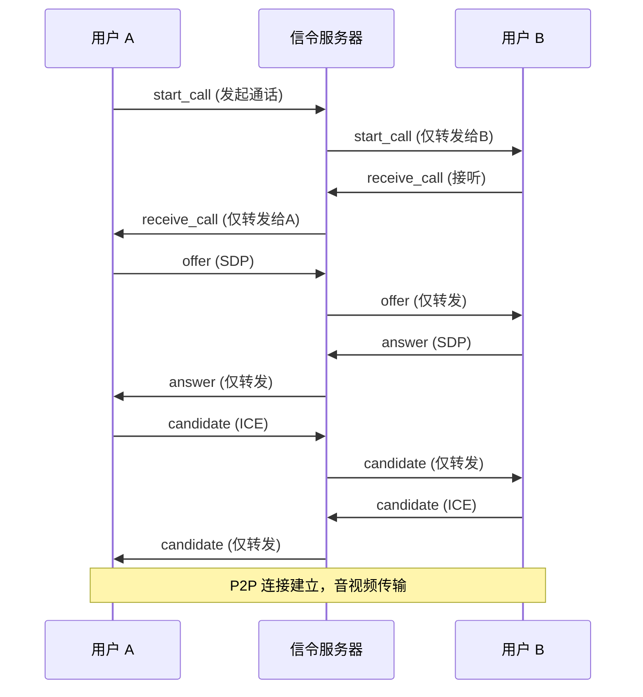

# 22. 音视频通话信令转发

> 本教程将利用现有的 WebSocket 通道，实现 WebRTC 音视频通话所需的信令转发机制。

---

## 📌 学习目标

- 理解 WebRTC 信令流程
- 定义信令消息格式
- 实现信令的透明转发
- 结合数据库实现通话记录
- 掌握音视频消息不回显的设计原因

---

## 1. WebRTC 原理简介

WebRTC 支持浏览器点对点(P2P)传输音视频流，但在建立 P2P 连接前，双方需要交换元数据(SDP, Candidate)。这个交换过程称为**信令(Signaling)**。

WebRTC 标准未规定信令实现，我们直接复用 WebSocket。

### 1.1 信令交互流程



**关键设计**：音视频信令消息**不回显**给发送者，避免重复触发通话事件。

---

## 2. 信令数据格式

> **代码位置**：`internal/service/chat/channel_server.go`

当 `Type=2` (AudioOrVideo) 时，数据存储在 `AVdata` 字段。

### 2.1 internal/dto/request/av_data_request.go

```go
package request

type AVData struct {
	MessageId string `json:"messageId"`
	Type      string `json:"type"`
}
```

### 2.2 信令类型

| type | 含义 | messageId | 是否存库 | 说明 |
|------|------|-----------|---------|------|
| `start_call` | 发起通话 | PROXY | ✅ 存库 | 记录通话发起事件 |
| `receive_call` | 接听通话 | PROXY | ✅ 存库 | 记录通话接听事件 |
| `reject_call` | 拒绝通话 | PROXY | ✅ 存库 | 记录通话拒绝事件 |
| `offer` | SDP Offer | PROXY | ❌ 不存库 | 仅转发 |
| `answer` | SDP Answer | PROXY | ❌ 不存库 | 仅转发 |
| `candidate` | ICE Candidate | PROXY | ❌ 不存库 | 仅转发 |
| `hangup` | 挂断 | PROXY | ❌ 不存库 | 仅转发 |

**存库条件**：
```go
if avData.MessageId == "PROXY" &&
   (avData.Type == "start_call" || avData.Type == "receive_call" || avData.Type == "reject_call") {
    // 存入数据库
}
```

---

## 3. 信令响应 DTO

### 3.1 internal/dto/respond/av_message_respond.go

```go
package respond

type AVMessageRespond struct {
	SendId     string `json:"send_id"`
	SendName   string `json:"send_name"`
	SendAvatar string `json:"send_avatar"`
	ReceiveId  string `json:"receive_id"`
	Type       int8   `json:"type"`
	Content    string `json:"content"`
	Url        string `json:"url"`
	FileType   string `json:"file_type"`
	FileName   string `json:"file_name"`
	FileSize   string `json:"file_size"`
	CreatedAt  string `json:"created_at"`
	AVdata     string `json:"av_data"`
}
```

---

## 4. 信令转发实现

### 4.1 internal/service/chat/channel_server.go

> **重要更新**：
> - 使用 `snowflake.GenerateID()` 生成 int64 UUID
> - 使用 `sync.Map` 管理客户端（`s.Clients.Load()`）

```go
// handleAVMessage 处理音视频通话信令
func (s *StandaloneServer) handleAVMessage(req request.ChatMessageRequest) {
	// 反序列化 AVData
	var avData request.AVData
	if err := json.Unmarshal([]byte(req.AVdata), &avData); err != nil {
		zap.L().Error(err.Error())
		return
	}

	// 构建消息模型
	message := model.Message{
		Uuid:       snowflake.GenerateID(), // 雪花 ID (int64)
		SessionId:  req.SessionId,
		Type:       req.Type,
		Content:    "",
		Url:        "",
		SendId:     req.SendId,
		SendName:   req.SendName,
		SendAvatar: req.SendAvatar,
		ReceiveId:  req.ReceiveId,
		FileSize:   "",
		FileType:   "",
		FileName:   "",
		Status:     message_status_enum.Unsent,
		CreatedAt:  time.Now(),
		AVdata:     req.AVdata,
	}

	// 只有关键信令才存库
	if avData.MessageId == "PROXY" && 
	   (avData.Type == "start_call" || avData.Type == "receive_call" || avData.Type == "reject_call") {
		message.SendAvatar = normalizePath(message.SendAvatar)
		if res := dao.GormDB.Create(&message); res.Error != nil {
			zap.L().Error(res.Error.Error())
		}
	}

	// 仅支持单聊信令转发
	if req.ReceiveId[0] == 'U' {
		messageRsp := respond.AVMessageRespond{
			SendId:     message.SendId,
			SendName:   message.SendName,
			SendAvatar: message.SendAvatar,
			ReceiveId:  message.ReceiveId,
			Type:       message.Type,
			Content:    message.Content,
			Url:        message.Url,
			FileSize:   message.FileSize,
			FileName:   message.FileName,
			FileType:   message.FileType,
			CreatedAt:  message.CreatedAt.Format("2006-01-02 15:04:05"),
			AVdata:     message.AVdata,
		}
		jsonMessage, _ := json.Marshal(messageRsp)

		messageBack := &MessageBack{
			Message: jsonMessage,
			Uuid:    message.Uuid,  // int64
		}

		// 使用 sync.Map 查找接收者 (自动并发安全)
		if value, ok := s.Clients.Load(message.ReceiveId); ok {
			receiveClient := value.(*UserConn)
			receiveClient.SendBack <- messageBack
		}
		// ⚠️ 通话信令不回显给发送者
	}
}
```

---

## 5. 为什么音视频消息不回显?

### 5.1 文本消息 vs 音视频消息

| 消息类型 | 是否回显 | 原因 |
|---------|---------|------|
| 文本消息 | ✅ 回显 | 发送者可能有多个设备在线，需要保持消息列表同步 |
| 音视频信令 | ❌ 不回显 | 避免发送者重复触发通话事件 |

### 5.2 回显的问题示例

**错误场景**（如果回显）：
```
用户 A 点击"视频通话"
   ↓
前端发送 start_call 信令
   ↓
服务器转发给 B 并回显给 A
   ↓
A 收到自己发送的 start_call
   ↓
❌ 前端误以为 B 也在呼叫 A
```

**正确场景**（不回显）：
```
用户 A 点击"视频通话"
   ↓
前端发送 start_call + 本地显示"正在呼叫..."
   ↓
服务器仅转发给 B
   ↓
B 收到 start_call，显示来电界面
   ↓
✅ 正常通话流程
```

---

## 6. 前端实现思路

### 6.1 发送信令消息

```javascript
function sendSignal(type, data = {}) {
    const message = {
        type: 2, // AudioOrVideo
        send_id: myUserId,
        send_name: myUserName,
        send_avatar: myAvatar,
        receive_id: remoteUserId,
        session_id: sessionId,
        av_data: JSON.stringify({
            messageId: "PROXY",
            type: type,
            ...data
        })
    };
    ws.send(JSON.stringify(message));
}
```

### 6.2 处理收到的信令

```javascript
ws.onmessage = async (event) => {
    const data = JSON.parse(event.data);
    if (data.type !== 2) return;

    const avData = JSON.parse(data.av_data);

    switch (avData.type) {
        case "start_call":
            await onStartCall(data);
            break;
        case "receive_call":
            await onReceiveCall(data);
            break;
        case "offer":
            await peerConnection.setRemoteDescription(avData.sdp);
            const answer = await peerConnection.createAnswer();
            await peerConnection.setLocalDescription(answer);
            sendSignal("answer", { sdp: answer });
            break;
        case "answer":
            await peerConnection.setRemoteDescription(avData.sdp);
            break;
        case "candidate":
            await peerConnection.addIceCandidate(avData.candidate);
            break;
        case "reject_call":
            closeCall();
            alert("对方拒绝了通话");
            break;
        case "hangup":
            closeCall();
            break;
    }
};
```

---

## 7. ICE 服务器配置

```javascript
const config = {
    iceServers: [
        { urls: 'stun:stun.l.google.com:19302' },
        {
            urls: 'turn:your-turn-server.com:3478',
            username: 'username',
            credential: 'password'
        }
    ]
};
```

---

## 8. 关键设计决策

| 决策 | 说明 |
|-----|------|
| 复用 WebSocket | 无需额外建立信令通道 |
| 选择性存库 | 只存 start/receive/reject |
| 不回显信令 | 避免重复触发通话事件 |
| 仅支持单聊 | 群聊通话需要 SFU 架构 |

---

## ✅ 教程完结

恭喜你完成了 **KamaChat** 项目的所有教程！🚀

### 你已经掌握了

- ✅ Go + Gin + GORM + Redis 技术栈
- ✅ WebSocket 长连接与读写分离
- ✅ 单聊/群聊消息即时转发
- ✅ Channel + Kafka 双模式消息队列
- ✅ 阿里云短信验证码集成
- ✅ 文件上传与静态资源服务
- ✅ HTTPS/WSS 安全配置
- ✅ WebRTC 信令转发机制

### 扩展方向

1. **群组音视频通话**：引入 SFU 架构
2. **屏幕共享**：使用 `getDisplayMedia()` API
3. **消息加密**：端到端加密(E2EE)
4. **消息已读回执**：增加已读状态同步
5. **离线推送**：集成 FCM/APNs
6. **消息撤回**：软删除 + WebSocket 通知

---

## 📚 推荐资源

- [WebRTC 官方文档](https://webrtc.org/)
- [MDN WebRTC API](https://developer.mozilla.org/en-US/docs/Web/API/WebRTC_API)
- [coturn TURN 服务器](https://github.com/coturn/coturn)
- [Gin 框架文档](https://gin-gonic.com/)
- [GORM 文档](https://gorm.io/)

希望这套教程能帮助你构建出属于自己的 IM 系统！🎉
