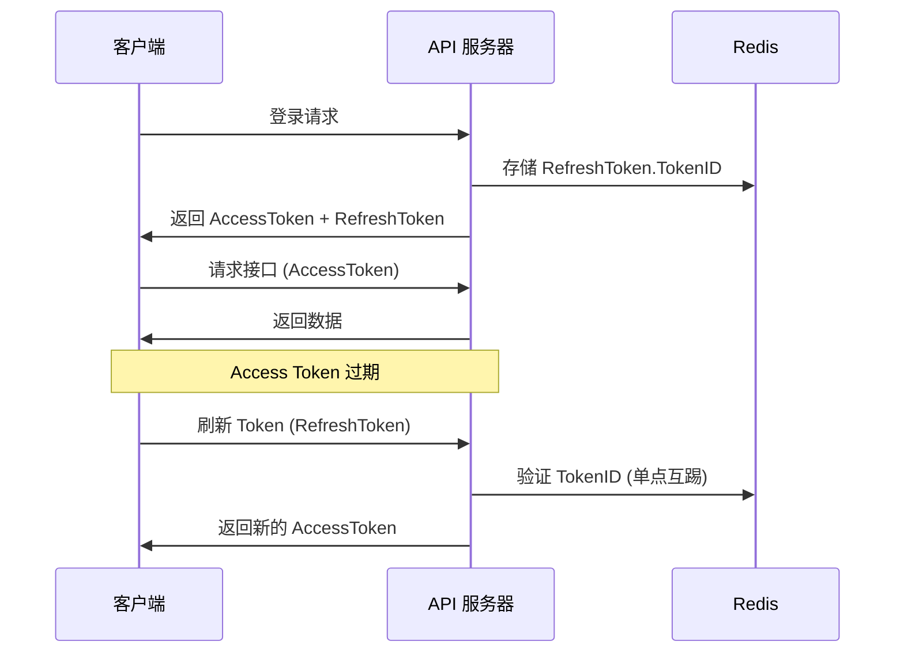

# 23. JWT 认证与单点登录

> 本教程将实现 JWT 双 Token 认证机制，包含 Access Token 接口认证和 Refresh Token 单点登录互踢。

---

## 📌 学习目标

- 理解 Access Token / Refresh Token 双 Token 机制
- 实现 JWT 工具类
- 实现 JWT 认证中间件
- 实现 Token 刷新接口（依赖注入模式）
- 理解 Redis 实现单点互踢

---

## 1. 双 Token 机制

### 1.1 为什么需要两个 Token?

| Token 类型 | 有效期 | 用途 | 安全性 |
|-----------|-------|------|--------|
| Access Token | 短(30分钟) | 接口认证 | 过期快，泄露风险低 |
| Refresh Token | 长(7天) | 刷新 Access Token | 存储在客户端安全位置 |

### 1.2 认证流程



---

## 2. 安装依赖

```bash
go get github.com/golang-jwt/jwt/v5
go get github.com/google/uuid
```

---

## 3. 配置文件

### 3.1 configs/config.toml

```toml
[jwtConfig]
secret = "your-jwt-secret-key-at-least-32-chars"
accessTokenExpiryMinutes = 30
refreshTokenExpiryHours = 168  # 7 天
```

### 3.2 internal/config/config.go

```go
type JWTConfig struct {
	Secret                   string `toml:"secret"`
	AccessTokenExpiryMinutes int    `toml:"accessTokenExpiryMinutes"`
	RefreshTokenExpiryHours  int    `toml:"refreshTokenExpiryHours"`
}

type Config struct {
	// ...
	JWTConfig JWTConfig `toml:"jwtConfig"`
}
```

---

## 4. JWT 工具类

### 4.1 pkg/util/jwt/jwt.go

```go
package jwt

import (
	"time"

	"github.com/golang-jwt/jwt/v5"
	"github.com/google/uuid"
)

// JWTConfig JWT 配置
type JWTConfig struct {
	Secret             string
	AccessTokenExpiry  time.Duration
	RefreshTokenExpiry time.Duration
}

var jwtConfig *JWTConfig

// Init 初始化 JWT 配置
func Init(secret string, accessExpiryMinutes, refreshExpiryHours int) {
	jwtConfig = &JWTConfig{
		Secret:             secret,
		AccessTokenExpiry:  time.Duration(accessExpiryMinutes) * time.Minute,
		RefreshTokenExpiry: time.Duration(refreshExpiryHours) * time.Hour,
	}
}

// Claims 自定义 JWT 声明
type Claims struct {
	UserID  string `json:"user_id"`
	TokenID string `json:"token_id,omitempty"` // 仅 Refresh Token 使用
	jwt.RegisteredClaims
}

// GenerateAccessToken 生成 Access Token
func GenerateAccessToken(userID string) (string, error) {
	claims := Claims{
		UserID: userID,
		RegisteredClaims: jwt.RegisteredClaims{
			ExpiresAt: jwt.NewNumericDate(time.Now().Add(jwtConfig.AccessTokenExpiry)),
			IssuedAt:  jwt.NewNumericDate(time.Now()),
			Issuer:    "kama_chat",
			Subject:   "access_token",
		},
	}
	token := jwt.NewWithClaims(jwt.SigningMethodHS256, claims)
	return token.SignedString([]byte(jwtConfig.Secret))
}

// GenerateRefreshToken 生成 Refresh Token
// 返回 token 字符串和 tokenID (用于 Redis 存储实现单点互踢)
func GenerateRefreshToken(userID string) (tokenString string, tokenID string, err error) {
	tokenID = uuid.NewString()
	claims := Claims{
		UserID:  userID,
		TokenID: tokenID,
		RegisteredClaims: jwt.RegisteredClaims{
			ExpiresAt: jwt.NewNumericDate(time.Now().Add(jwtConfig.RefreshTokenExpiry)),
			IssuedAt:  jwt.NewNumericDate(time.Now()),
			Issuer:    "kama_chat",
			Subject:   "refresh_token",
		},
	}
	token := jwt.NewWithClaims(jwt.SigningMethodHS256, claims)
	tokenString, err = token.SignedString([]byte(jwtConfig.Secret))
	return
}

// ParseToken 解析并验证 Token
func ParseToken(tokenString string) (*Claims, error) {
	token, err := jwt.ParseWithClaims(tokenString, &Claims{}, func(token *jwt.Token) (interface{}, error) {
		return []byte(jwtConfig.Secret), nil
	})
	if err != nil {
		return nil, err
	}
	if claims, ok := token.Claims.(*Claims); ok && token.Valid {
		return claims, nil
	}
	return nil, jwt.ErrSignatureInvalid
}
```

---

## 5. JWT 认证中间件

### 5.1 internal/infrastructure/middleware/jwt_middleware.go

```go
package middleware

import (
	"net/http"
	"strings"

	"kama_chat_server/pkg/errorx"
	"kama_chat_server/pkg/util/jwt"

	"github.com/gin-gonic/gin"
)

// JWTAuth JWT 认证中间件
func JWTAuth() gin.HandlerFunc {
	return func(c *gin.Context) {
		// 1. 从 Header 获取 Token
		authHeader := c.GetHeader("Authorization")
		if authHeader == "" {
			c.AbortWithStatusJSON(http.StatusUnauthorized, gin.H{
				"code": errorx.CodeUnauthorized,
				"msg":  "请先登录",
			})
			return
		}

		// 2. 解析 Bearer Token
		parts := strings.SplitN(authHeader, " ", 2)
		if len(parts) != 2 || parts[0] != "Bearer" {
			c.AbortWithStatusJSON(http.StatusUnauthorized, gin.H{
				"code": errorx.CodeUnauthorized,
				"msg":  "Token 格式错误，请使用 Bearer Token",
			})
			return
		}

		// 3. 验证 Token
		claims, err := jwt.ParseToken(parts[1])
		if err != nil {
			c.AbortWithStatusJSON(http.StatusUnauthorized, gin.H{
				"code": errorx.CodeUnauthorized,
				"msg":  "Token 已过期或无效，请重新登录",
			})
			return
		}

		// 4. 验证是否为 Access Token
		if claims.Subject != "access_token" {
			c.AbortWithStatusJSON(http.StatusUnauthorized, gin.H{
				"code": errorx.CodeUnauthorized,
				"msg":  "请使用 Access Token 访问此接口",
			})
			return
		}

		// 5. 将用户信息存入上下文
		c.Set("user_id", claims.UserID)
		c.Next()
	}
}
```

---

## 6. Token 刷新接口

### 6.1 internal/handler/auth_handler.go

> **架构变更**：使用依赖注入，通过 `AuthService` 接口验证 Token ID

```go
package handler

import (
	"kama_chat_server/internal/dto/request"
	"kama_chat_server/internal/service"
	"kama_chat_server/pkg/errorx"
	"kama_chat_server/pkg/util/jwt"

	"github.com/gin-gonic/gin"
)

// AuthHandler 认证请求处理器
type AuthHandler struct {
	authSvc service.AuthService
}

// NewAuthHandler 创建认证处理器实例
func NewAuthHandler(authSvc service.AuthService) *AuthHandler {
	return &AuthHandler{authSvc: authSvc}
}

// RefreshToken 刷新 Access Token
// POST /auth/refresh
func (h *AuthHandler) RefreshToken(c *gin.Context) {
	var req request.RefreshTokenRequest
	if err := c.ShouldBindJSON(&req); err != nil {
		HandleParamError(c, err)
		return
	}

	// 1. 解析 Refresh Token
	claims, err := jwt.ParseToken(req.RefreshToken)
	if err != nil {
		HandleError(c, errorx.New(errorx.CodeUnauthorized, "Refresh Token 已过期，请重新登录"))
		return
	}

	// 2. 验证是否为 Refresh Token
	if claims.Subject != "refresh_token" {
		HandleError(c, errorx.New(errorx.CodeUnauthorized, "请使用 Refresh Token"))
		return
	}

	// 3. 通过 Service 层验证 Token ID（单点互踢）
	valid, err := h.authSvc.ValidateTokenID(claims.UserID, claims.TokenID)
	if err != nil {
		HandleError(c, errorx.New(errorx.CodeUnauthorized, "登录状态已失效，请重新登录"))
		return
	}

	// 4. 比对 Token ID
	if !valid {
		HandleError(c, errorx.New(errorx.CodeUnauthorized, "您的账号已在其他设备登录"))
		return
	}

	// 5. 生成新的 Access Token
	newAccessToken, err := jwt.GenerateAccessToken(claims.UserID)
	if err != nil {
		HandleError(c, errorx.ErrServerBusy)
		return
	}

	HandleSuccess(c, gin.H{"access_token": newAccessToken})
}
```

---

## 7. AuthService 接口

### 7.1 internal/service/interfaces.go

```go
// AuthService 认证服务接口
type AuthService interface {
	// ValidateTokenID 验证 Token ID 是否有效（单点互踢检查）
	ValidateTokenID(userID, tokenID string) (bool, error)
	// StoreTokenID 存储 Token ID 到 Redis
	StoreTokenID(userID, tokenID string, expiry time.Duration) error
}
```

---

## 8. 路由配置

### 8.1 受保护路由示例

```go
func (r *Router) RegisterUserRoutes(group *gin.RouterGroup) {
	userGroup := group.Group("/user")
	{
		// 公开接口
		userGroup.POST("/login", r.handlers.User.Login)
		userGroup.POST("/register", r.handlers.User.Register)
	}

	// 需要认证的接口
	protectedGroup := group.Group("/user")
	protectedGroup.Use(middleware.JWTAuth())
	{
		protectedGroup.GET("/info", r.handlers.User.GetUserInfo)
		protectedGroup.POST("/update", r.handlers.User.UpdateUser)
	}
}
```

---

## 9. 登录时生成 Token

### 9.1 internal/service/user/service.go

```go
func (u *userService) Login(req request.LoginRequest) (*respond.LoginRespond, error) {
	// ... 验证密码逻辑 ...

	// 生成 Access Token
	accessToken, err := jwt.GenerateAccessToken(user.Uuid)
	if err != nil {
		return nil, errorx.ErrServerBusy
	}

	// 生成 Refresh Token
	refreshToken, tokenID, err := jwt.GenerateRefreshToken(user.Uuid)
	if err != nil {
		return nil, errorx.ErrServerBusy
	}

	// 存储 TokenID 到 Redis（单点互踢）
	jwtConfig := config.GetConfig().JWTConfig
	expiry := time.Duration(jwtConfig.RefreshTokenExpiryHours) * time.Hour
	if err := u.authSvc.StoreTokenID(user.Uuid, tokenID, expiry); err != nil {
		zap.L().Error("存储 TokenID 失败", zap.Error(err))
	}

	return &respond.LoginRespond{
		// ...
		AccessToken:  accessToken,
		RefreshToken: refreshToken,
	}, nil
}
```

---

## 10. 在 Handler 中获取用户 ID

```go
func (h *UserHandler) GetUserInfo(c *gin.Context) {
	// 从上下文获取用户 ID（由 JWTAuth 中间件设置）
	userID, exists := c.Get("user_id")
	if !exists {
		HandleError(c, errorx.ErrUnauthorized)
		return
	}

	// 使用 userID 查询用户信息
	info, err := h.userSvc.GetUserInfo(userID.(string))
	// ...
}
```

---

## 11. 初始化顺序

### 11.1 main.go

```go
func main() {
	conf := config.GetConfig()

	// 初始化 JWT
	jwt.Init(
		conf.JWTConfig.Secret,
		conf.JWTConfig.AccessTokenExpiryMinutes,
		conf.JWTConfig.RefreshTokenExpiryHours,
	)
	
	// ... 其他初始化 ...
}
```

---

## ✅ 本节完成

你已经完成了：
- [x] JWT 双 Token 机制设计
- [x] Access Token 生成与验证
- [x] Refresh Token 生成与刷新
- [x] JWT 认证中间件
- [x] 依赖注入模式的 AuthHandler
- [x] Redis 单点互踢实现

---

## 📚 下一步

继续学习 [24_雪花算法与分布式ID.md](24_雪花算法与分布式ID.md)，了解消息 ID 的生成机制。
