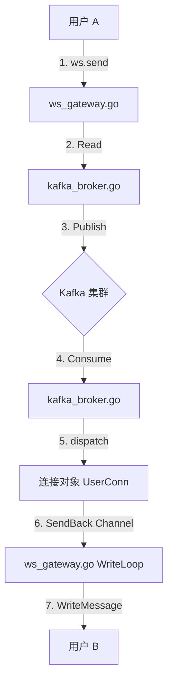

# 消息全链路生命周期 (Full Message Lifecycle)

本文档详细描述了一条消息从发送者指尖出发，经过 WebSocket、Go 服务器、Kafka 集群，最终到达接收者屏幕的完整闭环流程。

## 1. 上行阶段 (Upstream): 发送者 -> Kafka

**目标**：将用户 A 的消息安全、可靠地投递到 Kafka 集群。

### 步骤 1: 用户输入 & 发送
- **发起方**：用户 A 的手机/浏览器 (Frontend)
- **动作**：用户输入 "Hello"，点击发送。
- **底层**：前端调用 WebSocket API (`ws.send(...)`)，将 JSON 数据通过 TCP 连接发送出去。

### 步骤 2: Go 服务器接收 (Gateway)
- **接收方**：`ws_gateway.go` (Go Server)
- **方法**：`UserConn.Read()` -> `c.Conn.ReadMessage()`
- **逻辑**：
    1. 从 TCP 缓冲区读取二进制流。
    2. 此时消息还在 Go 服务器的内存中。

### 步骤 3: 内部转发 (Gateway -> Broker)
- **组件**：`ws_gateway.go`
- **方法**：`c.broker.Publish(ctx, jsonMessage)`
- **逻辑**：网关层不关心业务，直接调用接口将消息丢给 `Broker` (这里是 `KafkaBroker` 实现)。

### 步骤 4: 投递到 Kafka (Producer)
- **组件**：`kafka_broker.go` -> `kafka_client.go`
- **方法**：`k.kafkaClient.Producer.WriteMessages(...)`
- **逻辑**：
    1. Go 服务器作为 Kafka Producer。
    2. 将消息序列化并写入 Kafka 集群的指定 Topic (`chat_message`)。
    3. **完成上行**：此时消息已安全落地 Kafka。

---

## 2. 下行阶段 (Downstream): Kafka -> 接收者

**目标**：从 Kafka 集群捞出消息，精准推送给位于某台服务器上的用户 B。

### 步骤 5: 消费消息 (Consumer)
- **发起方**：Go 服务器 (集群中的每一台)
- **方法**：`kafka_broker.go` -> `readLoop()` -> `Consumer.ReadMessage()`
- **逻辑**：
    1. Go 服务器作为 Kafka Consumer，实时拉取 Topic 中的新消息。
    2. 这是一根“吸管”，源源不断地从 Kafka 吸取消息。

### 步骤 6: 内部路由 (Dispatch)
- **组件**：`kafka_broker.go`
- **方法**：`dispatch(message)`
- **逻辑**：
    1. 解析消息，查看 `ReceiveId` (假设是 User B)。
    2. 检查 User B 是否连接在**当前这台** Go 服务器上 (`GetClient("UserB")`)。
    3. 如果不在本机，丢弃（会被其他抢到消息的服务器处理）。
    4. 如果在本机，进入下一步。

### 步骤 7: 放入发送队列 (Queueing)
- **组件**：`kafka_broker.go`
- **方法**：`userConn.SendBack <- &MessageBack{...}`
- **逻辑**：找到 User B 的连接对象，将消息扔进由于内存保护的 Go Channel (`SendBack`)。

### 步骤 8: 写入网线 (Write Loop)
- **组件**：`ws_gateway.go`
- **方法**：`UserConn.Write()`
- **逻辑**：
    1. 一个专门的协程死守 `SendBack` 通道。
    2. 一旦发现新消息，立即取出。
    3. 调用 `c.Conn.WriteMessage(...)` 将字节流写入 TCP 连接。

### 步骤 9: 到达用户 B (Frontend)
- **接收方**：用户 B 的手机/浏览器
- **底层**：操作系统的 TCP 栈收到数据包。
- **应用层**：WebSocket Client 触发 `onmessage` 回调。
- **UI**：前端 JS/Native 代码解析 JSON，将 "Hello" 气泡渲染在聊天界面上。

---

## 流程图示

