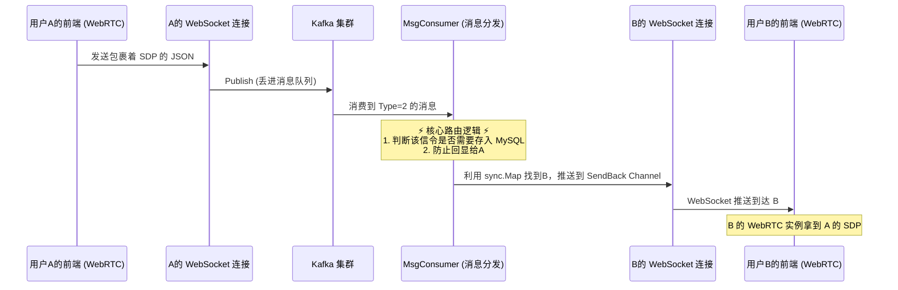

# KamaChat 音视频信令服务器完整教学文档

本教程旨在帮助你彻底理解什么是 WebRTC 的“信令服务器（Signaling Server）”，以及在 KamaChat 项目中，我们是如何利用现成的 WebSocket + Kafka 架构来实现这个功能的。

---

## 1. 原理篇：什么是 WebRTC 和信令？

在传统的直播或通话（例如早期基于 RTMP/HLS 流媒体服务器）中，所有的音视频数据都会先传给中央服务器，然后再由服务器分发给接收端，这会造成极大的带宽压力和延迟。

而 **WebRTC** 提供了一种点对点（P2P）直接传输媒体流的技术：**A 电脑的摄像头画面，可以直接走网线发给 B 电脑，完全不经过 KamaChat 的后端！**

### 1.1 为什么还需要服务器？
既然是直接连，还需要我们后端做什么呢？
想象一下 A 和 B 想要视频，他们需要知道彼此的“情况”：
- **A 的网络在哪？公网 IP 是什么？**（网络协商：`ICE Candidate`）
- **A 摄像头分辨率多少？支持什么视频编码（H.264 还是 VP8）？**（媒体协商：`SDP Offer / Answer`）
- **A 到底想不想要跟我开视频？B 点击了“接听”还是“挂断”？**（业务协商：`start_call`, `receive_call` 等）

这些交换协商信息的过程，就叫作**信令（Signaling）**。
WebRTC 标准本身并没有规定信令该怎么传，它只规定了生成这些信息（如 SDP）的 API。你可以用 HTTP 轮询、邮件甚至飞鸽传书来交换这些信息，只要能把 A 生成的字符串发给 B 就行。

KamaChat 选择**复用已有的 WebSocket 实时通讯通道**，作为这座负责交换名片（信令）的桥梁，这就是我们的信令服务器。

---

## 2. 架构篇：KamaChat 的信令链路

在 KamaChat 中，音视频相关的消息被定义为 `Type = 2` (即 `message_type.AudioOrVideo`)。

一条信令的完整旅行链路如下：



---

## 3. 实现篇：后端是如何处理信令的？

后端的核心逻辑位于 `internal/service/chat/kafka_broker.go` 文件中的 `handleAVMessage` 方法。我们来看看它做了哪些特殊的处理。

### 3.1 信令的格式设计
信令的数据包裹在 `Message.AVdata` 字段中（JSON 字符串），前端发送过来的核心长这样：
```json
{
  "messageId": "PROXY",     // 标识这是一个需要透传的信令
  "type": "start_call",     // 信令种类：offer / answer / candidate / start_call 等
  "sdp": "v=0\r\no=- 42... " // WebRTC 生成的具体数据
}
```

### 3.2 特殊处理 1：选择性入库（持久化）
普通的文本消息必定会存入 MySQL（`message` 表），但音视频信令绝大部分是单纯的网络建立日志，存起来毫无价值，徒增数据库压力。

**KamaChat 的策略是：只会把代表**用户行为**的信令存进数据库，用于在聊天记录中展示。**

```go
// 只有这三种能够构成聊天痕迹的动作，才会保存在 MySQL
if avData.MessageId == "PROXY" && (avData.Type == "start_call" || avData.Type == "receive_call" || avData.Type == "reject_call") {
    // 存入 message 表
    s.messageRepo.Create(&message)
    // 更新会话列表的最后一条消息提示字，如 "[通话]已接听"
    s.updateSessionLastMessage(&message, "[通话] 已接听")
}
// 而类似 "offer", "candidate" 则直接内存转发完毕，不在数据库留痕。
```

### 3.3 特殊处理 2：绝对不回显
普通发文字：A 发送 "你好"，服务器转发给 B，同时也会转发给 A（可能 A 打开了手机端和电脑端）。
**信令不能回显**：如果 A 正在给 B 拨打电话，发送了 `start_call` 信令，这时候 KamaChat 如果也给 A 回推了这条信令，A 的前端就会懵逼：“难道有人在给我打电话？”，引发严重的逻辑错乱。

```go
// 针对音视频消息，仅仅查找接收者的 WebSocket 并推送，不推给 SendId
if req.ReceiveId[0] == 'U' {
    if value, ok := s.Clients.Load(message.ReceiveId); ok { // 单聊维度查找B
        receiveClient := value.(*UserConn)
        receiveClient.SendBack <- messageBack // 仅推给B
    }
}
```

---

## 4. 实战篇：前端该如何配合？ (Web 端示例)

要完整跑通音视频，前端大致需要编写如下核心流程：

### 第一步：获取摄像头权限
```javascript
let localStream = await navigator.mediaDevices.getUserMedia({ video: true, audio: true });
// 把画面渲染到页面上的 <video id="localVideo"> 里
document.getElementById('localVideo').srcObject = localStream;
```

### 第二步：建立 WebRTC 连接对象 (RTCPeerConnection)
需要提供 ICE 穿透服务器（如果你们不在一个局域网，必须提供公网 TURN 服务器，否则 P2P 无法连接成功）。
```javascript
const configuration = {
    iceServers: [
        { urls: 'stun:stun.l.google.com:19302' }, // 谷歌公开的 STUN，测试用
        // 生产环境必须搭建并配置 TURN 服务器： { urls: 'turn:xxx.com', username: 'xx', credential: 'xx' }
    ]
};
let peerConnection = new RTCPeerConnection(configuration);
```

### 第三步：把摄像头画面塞进连接中
```javascript
localStream.getTracks().forEach(track => {
    peerConnection.addTrack(track, localStream);
});
```

### 第四步：监听对方推过来的视频流
```javascript
peerConnection.ontrack = (event) => {
    document.getElementById('remoteVideo').srcObject = event.streams[0];
};
```

### 第五步：最核心的部分——利用 KamaChat Backend 交换信令

1. **A 发起呼叫，生成 Offer 并发给 KamaChat 后端**
```javascript
// A 创建提议 (Offer)
let offer = await peerConnection.createOffer();
await peerConnection.setLocalDescription(offer);

// 通过 WebSocket 发送长辈给 KamaChat 的 MsgConsumer
socket.send(JSON.stringify({
    type: 2, // 告诉后端这是音视频数据
    receive_id: "UserB",
    av_data: JSON.stringify({ messageId: "PROXY", type: "offer", sdp: offer })
}));
```

2. **KamaChat 后端（MsgConsumer）收到后，原封不动推给 B 的 WebSocket**

3. **B 收到 Offer，生成 Answer 发给后端**
```javascript
// B 监听 WebSocket 收到的消息
socket.onmessage = async (event) => {
    let msg = JSON.parse(event.data);
    if (msg.type === 2) {
        let avData = JSON.parse(msg.av_data);
        if (avData.type === 'offer') {
             await peerConnection.setRemoteDescription(new RTCSessionDescription(avData.sdp));
             let answer = await peerConnection.createAnswer();
             await peerConnection.setLocalDescription(answer);
             
             // B 返回 Answer
             socket.send(JSON.stringify({
                 type: 2, receive_id: "UserA",
                 av_data: JSON.stringify({ messageId: "PROXY", type: "answer", sdp: answer })
             }));
        }
    }
}
```

4. **寻找对方网络互通的最短路径 (ICE Candidate)**
由于NAT和防火墙，A和B需要交换各自暴露出来的所有潜在 IP 地址和端口（Candidate），谁先连上就用哪个。这期间也会源源不断地通过 WebSocket 发给 KamaChat 转发。

```javascript
// 当浏览器发现新的可用网络路径时，会自动触发这个事件
peerConnection.onicecandidate = (event) => {
    if (event.candidate) {
        // 发给 KamaChat 让它透传
        socket.send(JSON.stringify({
             type: 2, receive_id: "UserB",
             av_data: JSON.stringify({ messageId: "PROXY", type: "candidate", candidate: event.candidate })
         }));
    }
};

// 对方收到 candidate 后的处理
socket.onmessage = async (event) => {
    // ... 解析 avData
    if (avData.type === 'candidate') {
        await peerConnection.addIceCandidate(new RTCIceCandidate(avData.candidate));
    }
}
```

至此，通过后端的勤勤恳恳的“快递”转发，A 和 B 的浏览器成功互相认了门，P2P 隧道建立，视频画面瞬间出现！

---

## 5. 总结

在 WebRTC 通话中，服务端扮演的仅仅是初始牵线搭桥的“红娘服务器（Signaling Server）”。
我们正是利用了现搭建好的高度并发、稳定的 WebSocket + Kafka 机制，稍加改造（处理好存库策略和回显策略），便零成本将其晋升为了一台合格的信令服务器。

实际生产中，音视频通话极大地受限于网络穿透成功率，如果出现画面出不来的情况，请务必检查**是否配置了正确的 TURN 服务器**来做视频流中转兜底。
